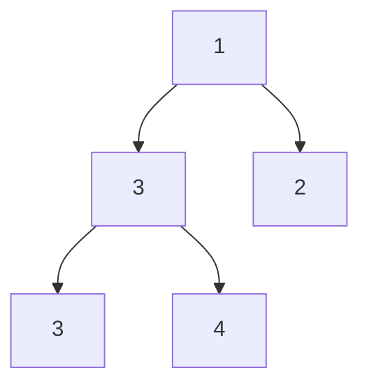
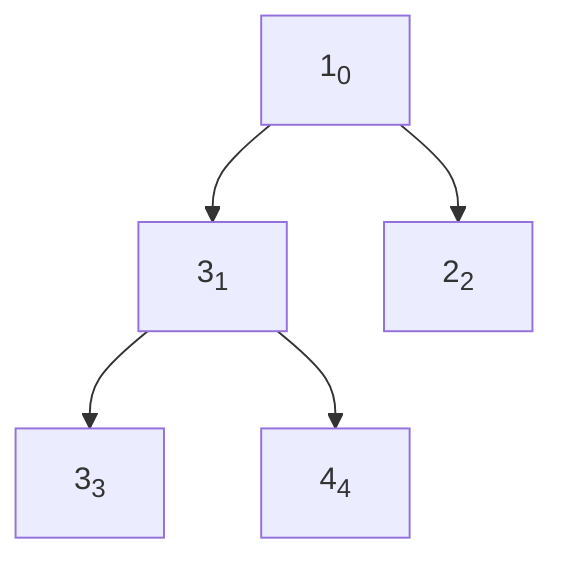
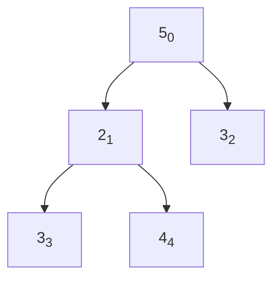
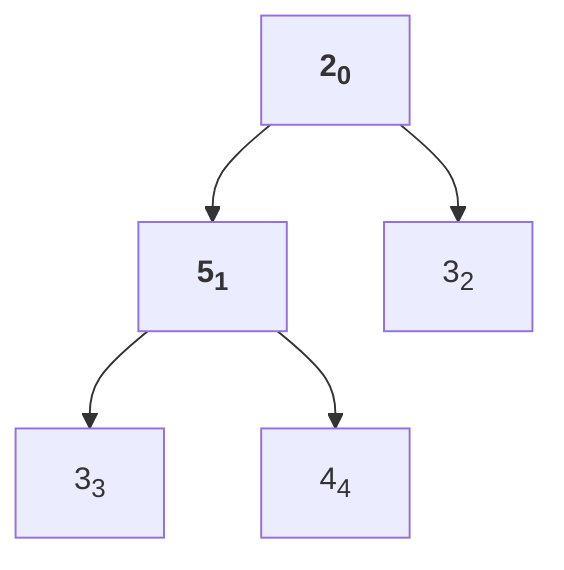
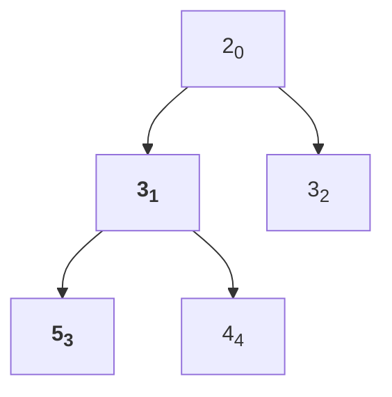
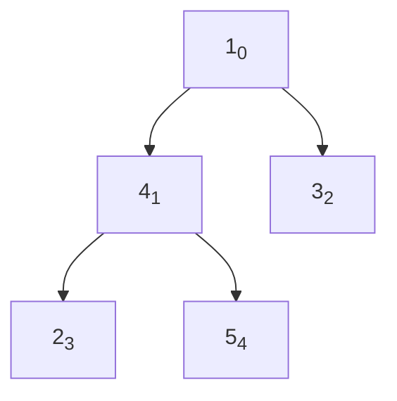
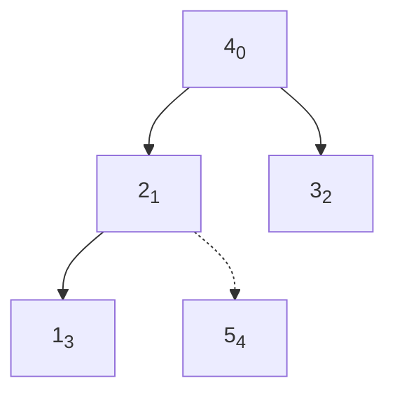
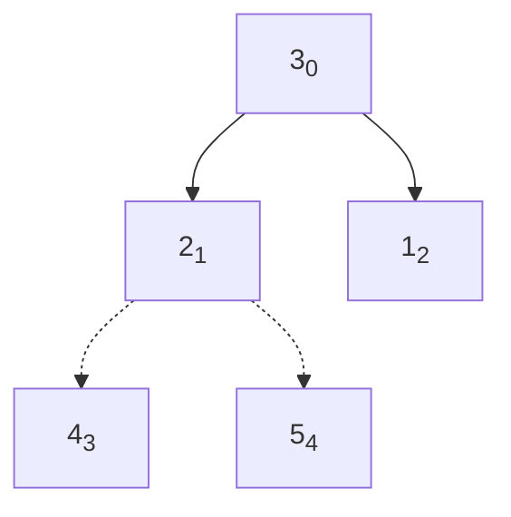
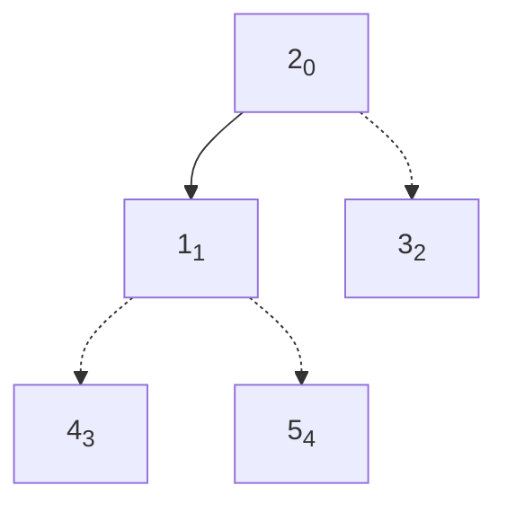
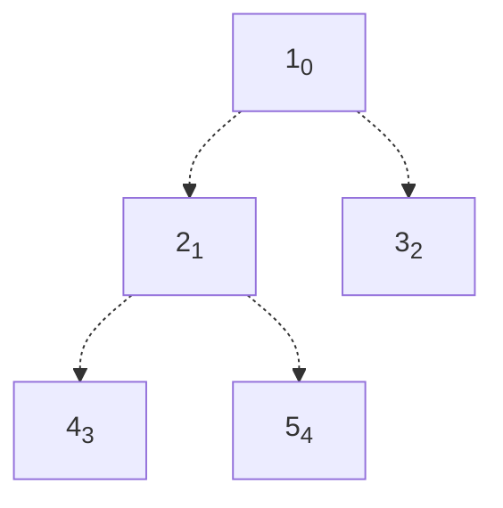

本节要介绍的是堆排序，这是一种高效且简单的排序算法，并且作为优先队列的基础被广泛应用。

## 堆
堆是一种部分有序的二叉树结构，以下图为例



图中描述的是一个标准的`小根堆`，即`每个父节点的值都小于等于子节点的二叉树`<br>
与之相反，`大根堆`就是`每个父节点的值都大于等于子节点的二叉树`<br>
堆本来就是二叉树，当然可以用二叉树的形式表示，为了方便和数组交互，我们采用堆的数组表示法。
+ 将数组下标作为每个节点的标识，假设下标为$$i$$
+ 左子节点下标为$$2i + 1$$，右子节点下标为$$2i + 2$$
+ 父节点下标为$$\frac{(n-1)}{2}$$，需排除下标为0的情况

下图即表示了数组[1, 3, 2, 3, 4]的二叉树形式



```text
《算法第四版》上的堆表示法是省略了下标0
那么左子节点就是2i，右子节点就是2i+1，父节点是n/2
本文没使用这种方法是为了避免原数组和堆数组间的转换
```

## 下沉操作
堆的定义并不复杂，那么如何建堆并利用堆来排序呢？需要用到下沉操作
+ 下沉操作的目的，是在某个子堆的父节点被替换后，把整个子树恢复成堆
+ 假设定义的是小根堆
+ 首先比较两个直接子节点的大小，再和父节点比较
  + 如果父节点小于等于子节点中中较小的，则堆已经形成，结束下沉操作
  + 否则将父节点和子节点中较小的交换，再对子节点所在的子树进行下沉操作

用下图演示，堆在下标0的元素被替换为5，进行下沉操作



首先将下标0和下标1互换



然后将下标1和下标3互换



下标3已经没有子节点，下沉操作结束，可以看到整个二叉树又恢复成了堆<br>
代码如下
```java
// https://leetcode.cn/problems/sort-the-people/submissions/588095391/
    public void sink(int[] nums, int i, int size, boolean asc) {
        while (2 * i + 1 < size) {
            int larger = 2 * i + 1;
            if (larger + 1 < size && compareTo(nums[larger], nums[larger + 1], asc) == -1) {
                larger++;
            }

            if (compareTo(nums[larger], nums[i], asc) != 1) {
                return;
            }
            swap(nums, i, larger);
            i = larger;
        }
    }
```
需要注意的是，排序为正序时，需要构造大根堆，即堆顶元素为数组最大值

## 建堆
将任意数组转换成堆的方法也很简单，就是从右到左对每个元素执行下沉操作，由于最下层元素树的大小是1，已经是一个堆，可以忽略，所以从数组大小n/2开始向左遍历。<br>
以数组[5, 4, 3, 2, 1]建小根堆举例


从下标5/2=2开始执行下沉操作


对下标1进行下沉操作


对下标0进行下沉操作，建堆完成


代码如下
```java
    public void build(int[] nums, boolean asc) {
        for (int i = nums.length / 2; i >= 0; i--) {
            sink(nums, i, nums.length, asc);
        }
    }
```

## 排序
建堆完就可以开始排序了，仍然以图示为例，假设数组为大根堆，进行正序排序


显然大根堆的堆顶为数组的最大值，正序应该排到数组最后，所以交换下标0和4<br>



这时数组已经不构成堆，需要对下标0进行下沉操作，这时设置数组大小为4，即忽略最后一个元素，图中用虚线表示




交换堆顶4并下沉



交换堆顶3并下沉



交换堆顶2并下沉，排序完毕



每次交换能取得一个最大元素，所以循环执行n-1次，即可使整个数组有序
```java
    public void sort(int[] nums, boolean asc) {
        // heap sort
        build(nums, asc);

        for (int i = nums.length; i >= 2; i--) {
            swap(nums, 0, i - 1);
            sink(nums, 0, i - 1, asc);
        }
    }
```
`空间复杂度`：算法从建树到排序都没有使用额外空间，也没有递归调用，复杂度为$$O(1)$$<br>
`时间复杂度`：统计比较操作，建树为$$O(n)$$（证明详见《算法第四版》），排序中下沉操作的比较次数和堆高度成正比，而堆高度为$$log_2{n}$$，所以排序的时间复杂度为

$$log_{2}(n-1)+log_{2}(n-2)+...+log_2{1}=log_{2}{(n-1)!}≈Nlog_2{N}$$

所以最终时间复杂度为$$Nlog_2{N}$$，可贵的是，这个复杂度不受输入影响，即时面对已经有序或者包含多数重复元素的数组，性能也不会退化到平方级别

## 结语
经典的排序算法就介绍到这里，后续将总结和对比提到的算法，并展示一些实际应用