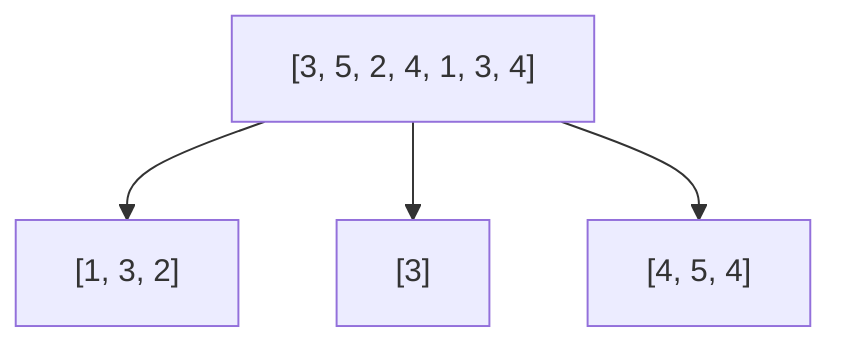
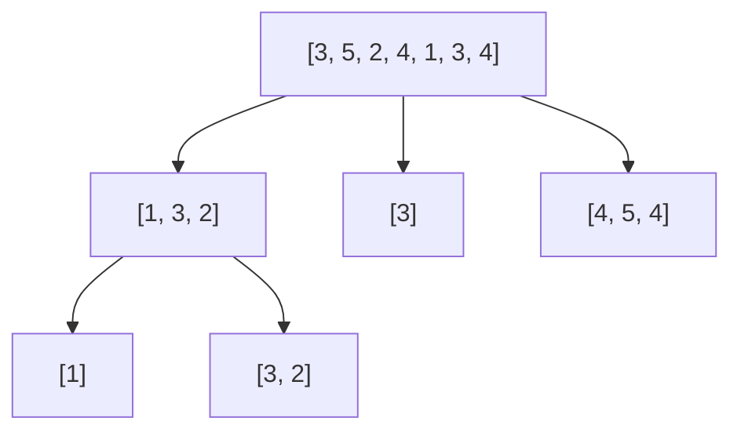
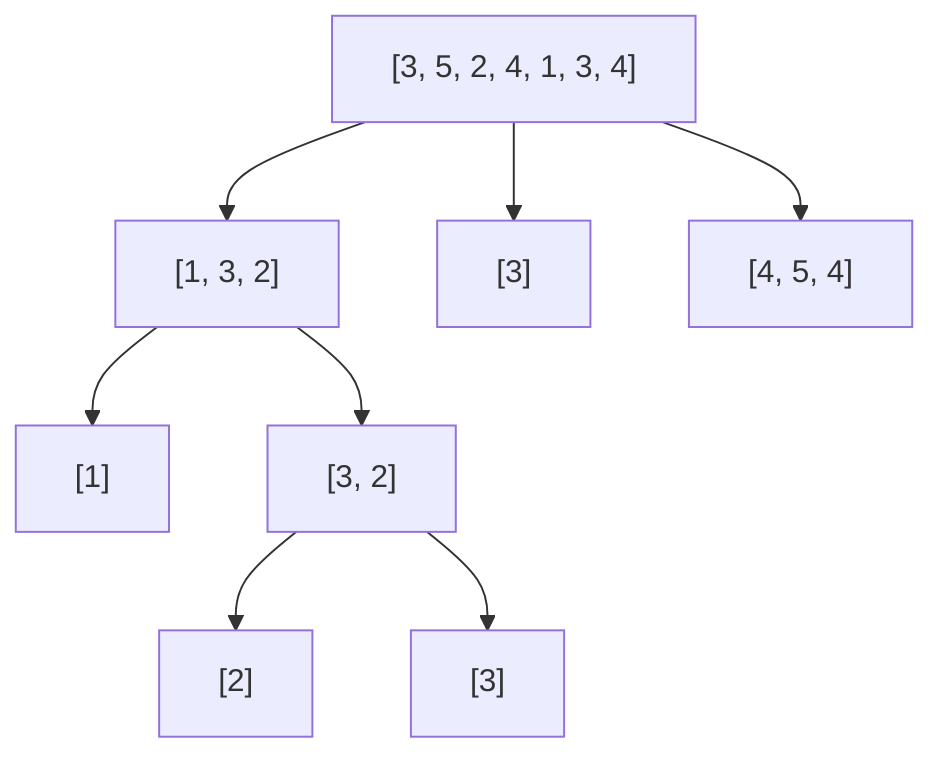
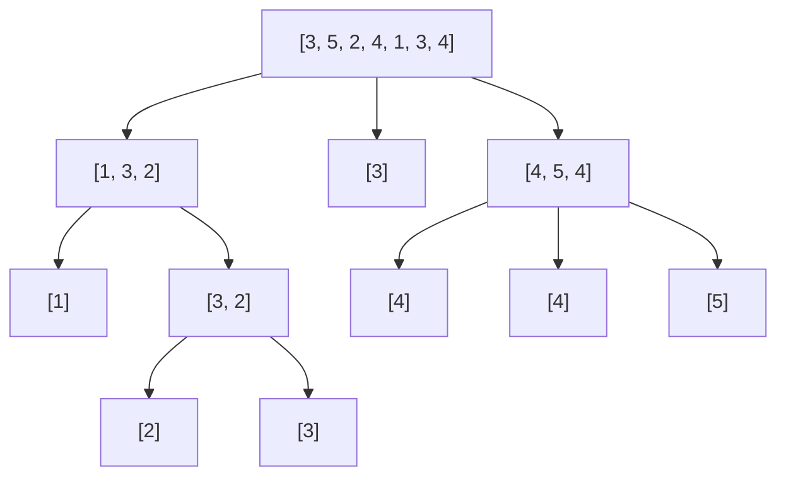

本节要介绍的排序算法更是重量级-快速排序，让我们看看它到底快在哪里。

## 划分
划分是快速排序的核心，类似于归并之于归并排序，还是用数组举例[3, 5, 2, 4, 1, 3, 4]。
+ 选取头元素3作为轴，左下标i=1(左侧的元素都不大于轴)，右下标j=n-1(右侧元素都大于轴)
+ i >= j时停止
    + 左下标右移，直到找到大于轴的元素 
    + 右下标左移，直到找到小于等于轴的元素
    + 交换左右下标上的元素
+ 加重显示左右下标在每个循环停止的位置
+ [3, **5**, 2, 4, 1, **3**, 4] -> [3, 3, 2, 4, 1, 5, 4]
+ [3, 3, 2, **4**, **1**, 5, 4] -> [3, 3, 2, 1, 4, 5, 4]
+ 如上例所示，循环终止在i=4, j=3的位置
+ 最终将头元素和`右下标`元素交换，得到[<font color="brown">1, 3, 2</font>, 3, <font color="light-blue">4, 5, 4</font>]，最终数组被分为<font color="brown">前半部分不大于3</font>和<font color="light-blue">后半部分大于3</font>的两部分

代码如下
```java
    // l为执行划分的子数组的起始下标，r为结束下标（不包含）
    public int partition(int[] nums, int l, int r, boolean asc) {
        int pivotal = nums[l];
        int i = l, j = r;

        while (true) {
            while (compareTo(nums[++i], pivotal, asc) != 1) {
                if (i == r - 1) {
                    break;
                }
            }

            while (compareTo(nums[--j], pivotal, asc) == 1) {}

            if (i >= j) {
                break;
            }

            swap(nums, i, j);
        }

        swap(nums, l, j);
        return j;
    }
```
需要注意的有如下几点：
+ 左下标右移时需要检查是否到达数组尾部，但是右下标左移时不需要，因为到达轴元素一定会触发停止条件
+ 最后选取右下标作为轴元素的最终位置，因为右下标在退出大循环(while true)时一定满足所有大于轴的元素都在右下标的右侧，而左下标不一定满足所有小于等于轴的元素都在其左侧，因为有可能左下标所在的元素就小于或等于轴（比如数组为[3, 1, 2]，左下标最终为2）。

## 排序
理解清楚划分之后，排序就很简单了
+ 首先进行对数据划分操作，[<font color="brown">1, 3, 2</font>, 3, <font color="light-blue">4, 5, 4</font>]，将数组分为`小于等于轴`、`轴`、`大于轴`三部分
+ 对`小于等于轴`和`大于轴`这两部分再进行递归排序
下面通过实例演示
  








接下来贴出代码
```java
    public void sort(int[] nums, boolean asc) {
        // quick sort
        sortInner(nums, 0, nums.length, asc);
    }

    public void sortInner(int[] nums, int l, int r, boolean asc) {
        if (l + 1 >= r) {
            return;
        }
        int mid = partition(nums, l, r, asc);
        sortInner(nums, l, mid, asc);
        sortInner(nums, mid + 1, r, asc);
    }
```
递归方法`sortInner`中过滤了数组大小为0或1的情况<br>
`空间复杂度`：快速排序并没有额外申请数组，都是原数组内的交换，空间消耗在于递归方法的堆栈消耗，由于划分操作近似于将数组二分，空间复杂度约为$$O(log_{2}n)$$<br>
`时间复杂度`：具体分析见《算法第四版》，平均为$$O(NlnN)$$，注意，此复杂度需要先将数组打乱，效率不受输入影响

## 优化
相较于归并排序，快速排序在时间复杂度上不相上下，而在空间复杂度上则更胜一筹，但在实际应用中，仍然有很大的优化空间
+ 类似于上一节归并排序的优化，在子数组较小时，可以使用插入排序代替递归
+ 在重复元素较多时，快速排序的效率会大打折扣，比如考虑[1, 1, 1, 1, 1]这种全部是元素重复的极端情况，算法的时间复杂度会退化到$$O(n^2)$$。
  这时可以用`三向切分`来代替原有的切分操作，简单来说就是把数组划分为`小于轴元素`、`等于轴元素`、`大于轴元素`三部分，再将前后两部分分别排序，具体内容详见《算法第四版》


## 结语
快速排序作为性能优秀、适应性强的排序算法在各种标准库中广泛应用，我们还会继续介绍其他有意思且高性能的排序算法，还请继续跟上脚步。
