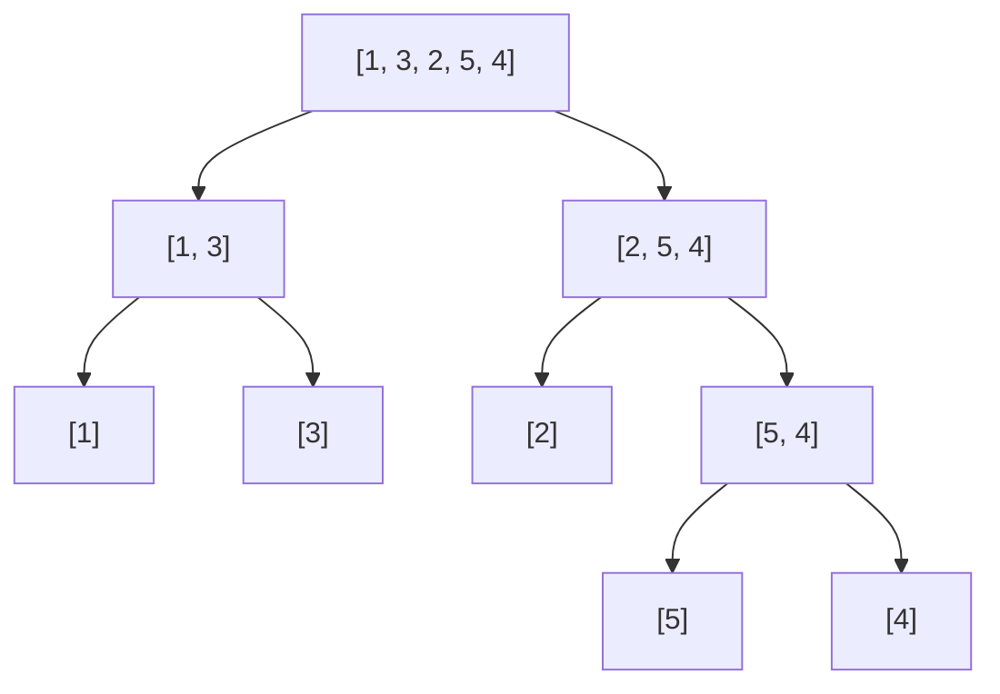
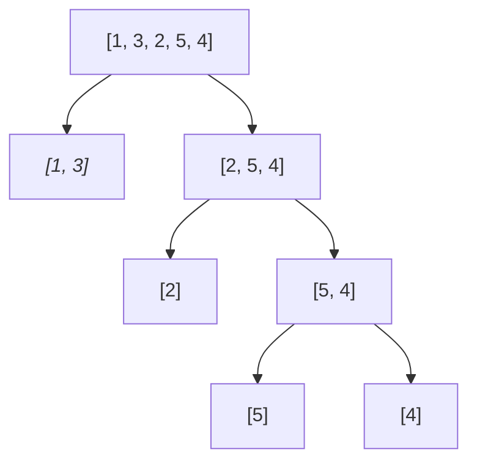
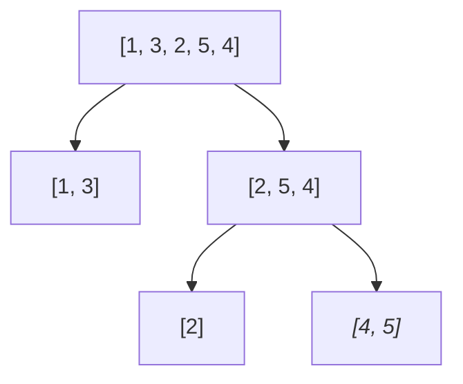
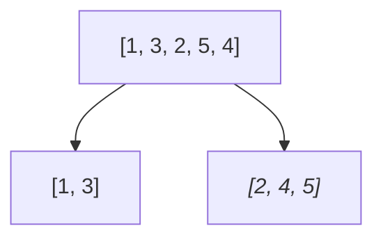
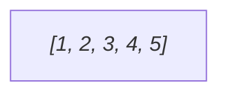

上一节中我们见到了两种基础的排序算法，平均的时间复杂度都是$$O(n^2)$$，本节我们会讲`归并排序`，这种算法更快，当然也更复杂。

## 归并
首先定义归并操作，即`将两个或多个有序的数组合并为一个`，归并排序中只需要合并两个有序数组，合并多个有序数组的操作叫做`多路归并`<br>
完整定义一下归并排序中的归并操作，即
+ 原数组为[$$a_1$$, $$a_2$$, ..., $$a_m$$, $$b_1$$, $$b_2$$, ..., $$b_n$$]，数组前半段和后半段均为有序数组，但数组整体不一定有序
+ 将数组变为整体有序的操作，称为归并操作

而归并操作又分为原地或非原地归并，区别在于是否申请新数组来完成归并操作，这里我们只讲解需要申请新数组的非原地归并<br>
这里还是通过实例讲解
+ 假设原数组为[**1**, 3, 5, **2**, 4, 6]，加粗标注了两个有序子数组的头元素
+ 开辟新数组，大小等于原数组，每次比较两个子数组，将较小的置入新数组，新旧数组变化如下
+ [3, 5], [2, 4, 6] -> [1]
+ [3, 5], [4, 6] -> [1, 2]
+ [5], [4, 6] -> [1, 2, 3]
+ [5], [6] -> [1, 2, 3, 4]
+ [], [6] -> [1, 2, 3, 4, 5]
+ [], [] -> [1, 2, 3, 4, 5, 6]

代码如下
```java
    // 辅助数组，大小等于原数组
    private static int[] aux;
    
    // l为第一个有序子数组的头下标， m为第二个有序子数组的头下标，r为第二个有序子数组的尾下标（不包含）
    private void merge(int[] nums, int l, int m, int r, boolean asc) {
        int i = l, j = m;
        int target = l;

        for (int k = l; k < r; k++) {
            aux[k] = nums[k];
        }

        while ((i != m) || (j != r)) {
            Integer n1 = i != m ? aux[i] : null;
            Integer n2 = j != r ? aux[j] : null;

            if (n1 == null ^ n2 == null) {
                if (n1 != null) {
                    nums[target++] = n1;
                    i++;
                } else {
                    nums[target++] = n2;
                    j++;
                }
            } else {
                if (asc ? n1 <= n2 : n2 <= n1) {
                    nums[target++] = n1;
                    i++;
                } else {
                    nums[target++] = n2;
                    j++;
                }
            }
        }
    }
```
上述代码比较繁琐的部分在于处理合并中一个子数组已经遍历完的情况，这里处理成取到遍历完子数组的值为空，就直接取另一个子数组的值。

## 排序
归并已经讲完，下面到排序了，归并排序原理其实并不复杂
+ 举个例子，原数组为[1, 3, 2, 5, 4]
+ 首先将数组不断二分，直到数组大小为1



+ 然后将子数组两两归并，斜体标注被归并的数组（注意，真实的代码执行顺序类似于后序遍历，和图中展示不一致，但是图示能准确表达算法思想）








代码如下
```java
// https://leetcode.cn/problems/sort-the-people/submissions/577195441/
    public void sort(int[] nums, boolean asc) {
        // merge sort
        aux = new int[nums.length];
        sortInner(nums, asc, 0, nums.length);
    }
    
    public void sortInner(int[] nums, boolean asc, int l, int r) {
        if (l == r || l + 1 == r) {
            return;
        }

        int mid = l + (r - l) / 2;
        sortInner(nums, asc, l, mid);
        sortInner(nums, asc, mid, r);
        merge(nums, l, mid, r, asc);
    }
```
算法是经典的递归形式，分为两种情况
+ 数组为空或只有一个元素时直接结束
+ 数组元素有两个或以上时，先二分为两个子数组分别排序，然后将两个有序的子数组进行归并操作

现在分析算法效率<br>
`空间复杂度`：由于是递归算法，算法执行形成堆栈（sortInner方法），层数最多为$$O(log_2n)$$，n为数组长度，所以堆栈带来的空间占用为$$O(log_2n)$$，
而归并操作用到了辅助空间$$O(n)$$，所以总的空间复杂度为$$O(n)$$<br>
`时间复杂度`：时间复杂度的证明可以参考《算法第四版》，结论为$$O(nlog_2n)$$，不受输入影响，这点十分重要，保证了归并排序的效率


`空间复杂度`：算法仅使用了常数级别的空间，即$$O(1)$$ <br>
`时间复杂度`：
* 最坏情况为数组为倒序，如[3, 2, 1]，第一次循环(插入元素为2)需要比较1次，第二次循环(插入元素为1)需要比较2次，总比较次数为$$\sum_{i=1}^{n-1} i = \frac{n(n-1)}{2}$$ ，此时时间复杂度为$$O(n^2)$$
* 最佳情况为数组有序，如[1, 2, 3]，只需比较`n-1`次，所以时间复杂度为$$O(n)$$
* 平均时间复杂度为$$O(n^2)$$

## 优化
《算法第四版》中提出了归并排序的几个优化方向，大家可以思考并实践一下
+ 二分为子数组时，如果数组大小足够小（比如小于10个元素），采用插入排序，而不是一直二分到不能分为止再合并
+ 当待合并的两个子数组已经有序，即$$nums[mid - 1] <= nums[mid]$$时，省略归并操作
+ 每次归并操作都会先将原数组全部复制到辅助数组，合并过程中又将辅助数组复制到原数组，如果把这两个数组作为参数传入，即指定数组复制的方向，就可以节省一倍的数组复制成本，但是需要在代码中控制`从原数组复制到辅助数组`及其反向的过程

## 结语
归并排序是本系列目前接触到时间效率最高的排序算法，只是空间上还稍有瑕疵，是否有空间更优，且时间效率相当的排序算法？且听下回分解。
