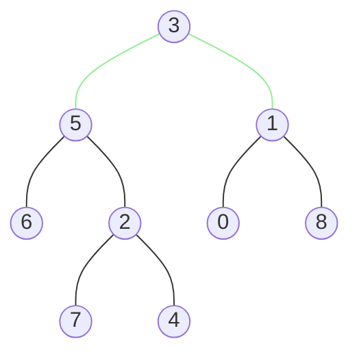
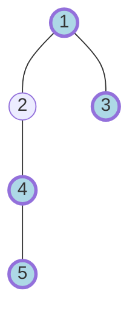

这里默认大家已经对二叉树有基本的认识，在这个基础上做一下拓展和巩固。
## 表示
本文沿用力扣中的二叉树节点定义，包含左右节点和整数值
```java
 public class TreeNode {
     int val;
     TreeNode left;
     TreeNode right;
     TreeNode(int val, TreeNode left, TreeNode right) {
         this.val = val;
         this.left = left;
         this.right = right;
     }
 }
```

## 遍历
二叉树的遍历方式一般有四种
+ 先序
+ 中序
+ 后序
+ 层次

我们通过题目来看怎么应用各种遍历
### 后序
```text
https://leetcode.cn/problems/lowest-common-ancestor-of-a-binary-tree
给定二叉树，找到两个指定节点p、q的最近公共祖先。
祖先是一个节点从父节点上溯到根节点路径中的所有节点（包含节点自身）。
最近公共祖先是两个节点公共祖先中深度最大的。
```

如下图，p=5，q=1


很明显，根节点3是节点5和1的最近公共祖先<br>
要求解这个问题，我们需要三部分信息
+ 当前节点是不是p或者q
+ 左子树中是否包含p或者q
+ 右子树中是否包含p或者q

在子树结果从下到上收集的过程中，只要某个节点最先满足p和q都包含在子树中或者等于自身<br>
这个节点就是最近公共祖先

```java
// https://leetcode.cn/problems/lowest-common-ancestor-of-a-binary-tree/submissions/592388405
    TreeNode result;

    public TreeNode lowestCommonAncestor(TreeNode root, TreeNode p, TreeNode q) {
        result = null;
        traverse(root, p, q);
        return result;
    }

    public boolean[] traverse(TreeNode root, TreeNode p, TreeNode q) {
        if (root == null) {
            return null;
        }

        boolean[] left = traverse(root.left, p, q);
        boolean[] right = traverse(root.right, p, q);

        boolean[] pair = null;
        pair = new boolean[2];

        pair[0] = (p == root) || (left != null && left[0]) || (right != null && right[0]);
        pair[1] = (q == root) || (left != null && left[1]) || (right != null && right[1]);

        if (pair[0] && pair[1] && result == null) {
            result = root;
        }
        return pair;
    }
```
+ pair[0]表示当前节点及其子树是否包含p
+ pair[1]表示当前节点及其子树是否包含q
+ traverse在左右子树都处理完之后才执行判断，所以是后序遍历
+ 仅当`result==null`时才赋值，所以取的是深度最大的公共祖先
+ result也可以包装在递归函数的返回值中，而不是作为成员变量被共享

### 层次
```text
https://leetcode.cn/problems/binary-tree-right-side-view
想象站在二叉树右侧向左看，返回从上到下看到的节点值
```
以下树为例

输出为[1,3,4,5]<br>
这是很典型可以用层次遍历解决的问题<br>
但我们也可以使用先序遍历+记录层数来解决
```java
// https://leetcode.cn/problems/binary-tree-right-side-view/submissions/591974945
    public List<Integer> rightSideView(TreeNode root) {
        List<Integer> result = new ArrayList<>();
        rightSideView(root, result, 0);
        return result;
    }

    public void rightSideView(TreeNode root, List<Integer> result, int level) {
        if (root == null) {
            return;
        }

        if (level == result.size()) {
            result.add(root.val);
        }

        rightSideView(root.right, result, level + 1);
        rightSideView(root.left, result, level + 1);
    }
```
+ 采用`根右左`的顺序，首先访问到每一层最右边的元素
+ result仅记录每一层第一个访问的元素

## 构造

## 路径


## 结语
二叉树是理解递归的绝佳方式，也有助于图和森林的学习，希望本文能以点带面，帮大家拓宽思路、加深理解。