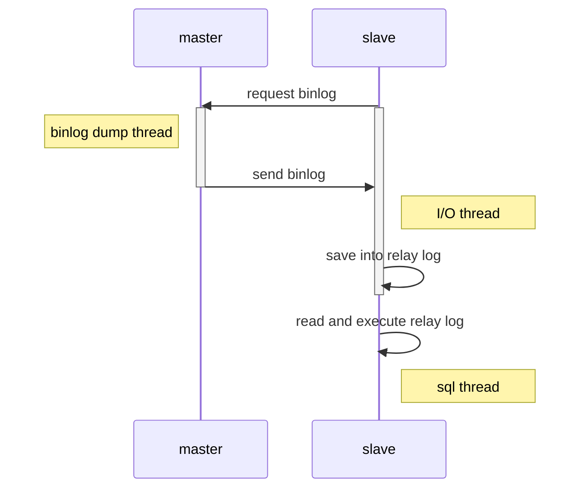

要深入理解数据库的原理，就不得不提到mysql中的redo、undo和bin log三种日志。  
数据库的核心功能事务以及数据恢复、主从复制都依赖于这三种日志。  
本章讲解均基于mysql-8.0.41版本，不同版本实现有差异，但原理是一样的。

## write ahead log
在进入话题之前先简单介绍一下数据库乃至分布式系统实现用到的一种核心技术：write ahead log。  
简单来说就是将写操作分为两步(这里的写不限于数据修改，还包括表的修改及配置修改等等):
+ 先将操作记录成日志，存储到持久性介质中，比如磁盘。
+ 再将写操作真正执行，一般来说也是修改磁盘中的某个文件，但是这个操作可以延迟执行，比如定期刷新，不需要立即执行。

这里我们通过一个小的项目模拟一下
+ 克隆 https://github.com/cafewang/playground
+ 在idea中运行测试类WALTest

被测类为MiniDB，是一个简单的K/V数据库，有如下字段

```java
    // 数据库支持的操作，set就是将key设为某个值，inc是加一，dec是减一
    private static enum OpType {
        SET, INC, DEC;
    }
    
    @NoArgsConstructor
    @AllArgsConstructor
    private static class WriteAheadLog {
        OpType opType;
        Integer key;
        Integer value;
    }
    
    // 持久化的WAL列表，可以稳定写入WAL
    private final List<WriteAheadLog> persistentList;
    // 模拟数据库的持久化存储
    private final Map<Integer, Integer> persistentStorage;
    // 模拟写入失败的场景(注意，persistentList的写入不会失败)
    private boolean somethingWrongHappens;
    // 模拟写入失败的概率
    private final Random random;
```
以set操作实现为例，先将操作写入WAL，再真正落盘(以Map代替)，落盘有概率失败，导致数据不一致。
```java
    public void set(int key, int value) {
        persistentList.add(new WriteAheadLog(OpType.SET, key, value));
        somethingMayGoWrong(() -> doSet(key, value));
    }

    private void doSet(int key, int value) {
        persistentStorage.put(key, value);
    }
```
再来看get操作，如果感知到数据不一致，会使用wal列表从头开始遍历，重建persistentStorage，这样就保证了数据一致性。
```java
    public Integer get(int key) {
        if (somethingWrongHappens) {
            build();
            somethingWrongHappens = false;
        }
        return persistentStorage.get(key);
    }

    private void build() {
        persistentStorage.clear();
        for (WriteAheadLog wal : persistentList) {
            if (wal.opType == OpType.SET) {
                doSet(wal.key, wal.value);
            } else if (wal.opType == OpType.INC) {
                doIncrement(wal.key);
            } else if (wal.opType == OpType.DEC) {
                doDecrement(wal.key);
            }
        }
    }
```
我们将失败概率设置为0.5，执行如下操作
+ 执行set(1, 100)
+ 执行100次inc(1)
+ 执行50次dec(1)

最终get(1)返回了正确值150，需要先执行修复操作（大概率会执行）。  
这就是最基本的WAL原理，当然实际应用要复杂的多，因为数据库的数据类型繁多、操作也各不相同，还需要将多个操作打包为事务一起执行，但是上述的mysql的三种log都是基于这个原理实现的。

## redo log
首先需要知道的是，mysql innodb引擎是以页的形式管理数据的，和文件系统有点相似。  
这些页存放在磁盘中是数据文件，加载到内存中称为buffer pool。简单来说，查询的时候，会将数据涉及的页都加载到buffer pool中；  
修改的时候，先讲涉及记录的页加载到buffer pool中，然后修改这些页，被修改的页就称为脏页。  
显然包含脏页的mysql系统，内存和磁盘的数据是不一致的，内存中是最新的版本。  
引入wal的概念，将脏页中的数据变更记录成日志，就称为redo log，下图就是redo log的基本流程。


### 存储
首先需要明确，redo log是innodb管理的结构，不在server层。  
在内存中，redo log存储在称为log buffer的结构中，在磁盘中，redo log存储在一组文件中，这组文件是循环写入的，由两个指针记录位置
+ checkpoint指针(文档称为checkpoint lsn)，记录对应数据页已经落盘的redo log序号
+ current指针(文档称为current lsn)，记录最新加入log buffer的redo log序号，这个redo log不一定已经落盘

两个指针的位置都是递增的，每个文件表示一个位置的范围，可以用如下sql查询。

```text
SELECT FILE_NAME, START_LSN, END_LSN FROM performance_schema.innodb_redo_log_files;}
```

|         FILE_NAME        | START_LSN | END_LSN  |
|:------------------------:|:---------:|----------|
| ./#innodb_redo/#ib_redo8 | 26206208  | 29480960 |

redo log文件总大小可以设置，假设文件总共有四个，初始两指针位置如下。


<script defer type="text/tikz" data-tikz-libraries="positioning">
\begin{tikzpicture}[
every node/.style={minimum size=1cm, outer sep=0, inner sep=0, font=\large\bfseries},
]
\draw (1,1.732) arc [x radius=2, y radius=2, start angle=420, end angle=60]
      node foreach \t/\i in {0/0,0.25/1,0.5/2,0.75/3} [pos=\t] (a\i) {};
\draw (0.5,0.866) arc [x radius=1, y radius=1, start angle=420, end angle=60]
      node foreach \t/\i in {0/0,0.25/1,0.5/2,0.75/3} [pos=\t] (b\i) {};

\foreach \x in {0,...,3} {
    \draw (a\x.center) -- (b\x.center);
}

\draw[draw=none] (a0) -- (a1) node[midway, sloped] {ib\_redo0};
\draw[draw=none] (a1) -- (a2) node[midway, sloped] {ib\_redo1};
\draw[draw=none] (a2) -- (a3) node[midway, sloped] {ib\_redo2};
\draw[draw=none] (a3) -- (a0) node[midway, sloped] (l3) {ib\_redo3};


\node[above=12pt of l3, xshift=10] {init};

\draw[->] (60:2.1) -- (60:3) node[right=3pt] (c0) {checkpoint};
\node[below=-15pt of c0] {current};

\end{tikzpicture}
</script>

更新事务较多时，在log buffer中堆积了很多redo log，产生了很多脏页，checkpoint和current指针之间的距离就能反映脏页的多少。  

<script defer type="text/tikz" data-tikz-libraries="positioning">
\begin{tikzpicture}[
every node/.style={minimum size=1cm, outer sep=0, inner sep=0, font=\large\bfseries},
]
\draw (1,1.732) arc [x radius=2, y radius=2, start angle=420, end angle=60]
      node foreach \t/\i in {0/0,0.25/1,0.5/2,0.75/3} [pos=\t] (a\i) {};
\draw (0.5,0.866) arc [x radius=1, y radius=1, start angle=420, end angle=60]
      node foreach \t/\i in {0/0,0.25/1,0.5/2,0.75/3} [pos=\t] (b\i) {};

\foreach \x in {0,...,3} {
    \draw (a\x.center) -- (b\x.center);
}

\draw[draw=none] (a0) -- (a1) node[midway, sloped] {ib\_redo0};
\draw[draw=none] (a1) -- (a2) node[midway, sloped] {ib\_redo1};
\draw[draw=none] (a2) -- (a3) node[midway, sloped] {ib\_redo2};
\draw[draw=none] (a3) -- (a0) node[midway, sloped] (l3) {ib\_redo3};


\node[above=12pt of l3, xshift=10] {running};

\draw[->] (30:2.1) -- (30:3) node[right=3pt] (c0) {checkpoint};
\draw[->] (-210:2.1) -- (-210:3) node[left=3pt] (c1) {current};

\draw[->] (25:2.5) arc [x radius=2.5, y radius=2.5, start angle=385, end angle=155];

\end{tikzpicture}
</script>

当current追上checkpoint指针时，表示redo log文件已经满了，需要将脏页落盘，使得checkpoint指针前移，才能继续执行更新操作。  

<script defer type="text/tikz" data-tikz-libraries="positioning">
\begin{tikzpicture}[
every node/.style={minimum size=1cm, outer sep=0, inner sep=0, font=\large\bfseries},
]
\draw (1,1.732) arc [x radius=2, y radius=2, start angle=420, end angle=60]
      node foreach \t/\i in {0/0,0.25/1,0.5/2,0.75/3} [pos=\t] (a\i) {};
\draw (0.5,0.866) arc [x radius=1, y radius=1, start angle=420, end angle=60]
      node foreach \t/\i in {0/0,0.25/1,0.5/2,0.75/3} [pos=\t] (b\i) {};

\foreach \x in {0,...,3} {
    \draw (a\x.center) -- (b\x.center);
}

\draw[draw=none] (a0) -- (a1) node[midway, sloped] {ib\_redo0};
\draw[draw=none] (a1) -- (a2) node[midway, sloped] {ib\_redo1};
\draw[draw=none] (a2) -- (a3) node[midway, sloped] {ib\_redo2};
\draw[draw=none] (a3) -- (a0) node[midway, sloped] (l3) {ib\_redo3};


\node[above=12pt of l3, xshift=10] {full};

\draw[->] (30:2.1) -- (30:3) node[right=3pt] (c0) {checkpoint};
\draw[->] (395:2.1) -- (395:3) node[right=-10pt, yshift=15pt] (c1) {current};

\draw[->] (25:2.5) arc [x radius=2.5, y radius=2.5, start angle=385, end angle=40];

\end{tikzpicture}
</script>

### 刷盘策略
可以设置`innodb_flush_log_at_trx_commit`控制redo log的刷盘策略（注意，不是数据的刷盘）
+ 0: 事务提交时不刷盘，这样redo log会由后台线程每1s执行刷盘，不能保证持久性
+ 1: 每次提交时保存redo log
+ 2: 提交时把log buffer中的redo log写入page cache(文件系统缓存)，这样也不能保证持久性

## undo log
redo log存储的是`数据页被修改后的状态`，也就是说，仅凭借redo log我们无法回滚事务，这时我们需要一个记录数据更改前后状态的结构，这就是undo log。  
undo log存储了一条记录在修改前的数据，注意是一条记录，而不是redo log这样存储数据页的变更。

### 存储
在内存中，undo log存储在undo log segment中，而一个rollback segment管理若干个undo log（页大小为16KB时，这个数字是1024）。  
落盘后，undo log存储在特殊的数据页中，如下图所示，按是否为临时表 以及 是insert或update/delete操作 两个维度分别存储。  


### 删除
在MVCC这篇文章中，我们提到过，数据行会引用undo log来查找历史版本的记录，所以包含在ReadView中事务的undo log不能在提交后删除，  
因为需要在版本链中引用更早的数据，因此需要等这些ReadView的事务提交才能删除(在内存中)。  
insert在提交后可以直接删除。

## bin log
不同于redo log和undo log是innodb上的结构，bin log是server层的结构，与引擎无关。  
bin log的作用主要就是主从同步，也会用于崩溃恢复。  

### 格式
bin log有三种格式
+ statement: 记录每条sql语句，包括行的修改或者表结构的修改等
+ row: 记录每条记录的变更，是默认格式
+ mixed: 默认使用statement，少数情况切换到row

推荐保持默认，使用row格式，因为statement部分场景下会产生主从数据不一致。

### 查看
使用mysql自带的mysqlbinlog工具查看日志

```shell
mysqlbinlog binlog.000002 --base64-output=decode-rows -vv

#250330  9:47:36 server id 1  end_log_pos 2342 CRC32 0x02527067         Update_rows: table id 98 flags: STMT_END_F
### UPDATE `user`.`employee`
### WHERE
###   @1=10 /* INT meta=0 nullable=0 is_null=0 */
###   @2=110 /* INT meta=0 nullable=0 is_null=0 */
###   @3='lame' /* VARSTRING(180) meta=180 nullable=1 is_null=0 */
### SET
###   @1=10 /* INT meta=0 nullable=0 is_null=0 */
###   @2=110 /* INT meta=0 nullable=0 is_null=0 */
###   @3='shame' /* VARSTRING(180) meta=180 nullable=1 is_null=0 */
# at 2342
```
参数是用于展示详细内容，可以看到bin log中存储了行变更前后的完整记录。

### 主从同步
主从同步大致流程如下



### 刷盘策略
binlog在内存中存储在binlog cache上，每个事务独享一个cache，刷盘时机通过`sync_binlog`参数控制
+ 0: 不强制要求，由系统判断刷盘时机
+ 1: 每次提交事务时将binlog刷盘
+ N: 每N个事务，将binlog刷盘

## 崩溃恢复
首先简单描述事务提交的流程
1. 将数据更新到buffer pool中
2. 生成prepare状态的undo log
3. 记录数据变更和undo log变更到redo log中，状态为prepare
4. 生成binlog并刷盘(server层)
5. 将undo log和redo log改为完成状态

顺序就是先创建prepare状态的undo log和redo log，在生成binlog并刷盘，最后提交undo log和redo log。  
这样redo log和binlog有如下几种状态
+ redo log为prepare，binlog未写入，这时从库收不到binlog，需要回滚事务
+ redo log为prepare，binlog已写入，从库已经执行事务，主库也需要提交事务
+ redo log为commit状态，已提交

所以，崩溃恢复时，数据库加载一个checkpoint，找到之后的redo log，结合binlog状态选择回滚或提交。

## 总结

|          |  位置  |                   内存结构                   | 文件结构 |                                            刷盘策略                                           |        作用        |
|:--------:|:------:|:--------------------------------------------:|:--------:|:---------------------------------------------------------------------------------------------:|:------------------:|
| redo log | innodb |                  log buffer                  |  循环写  | 0: 提交时不刷盘，后台线程每1s执行刷盘<br>1: 每次提交时保存redo log<br>2: 提交时写入page cache | 持久性<br>崩溃恢复 |
| undo log | innodb | rollback segment<br>中的<br>undo log segment |  数据页  | redo log刷盘后就不会丢失，等待后台线程落盘                                                    |      回滚MVCC      |
|  binlog  | server |                 binlog buffer                |   文件   | 0: 不强制要求，由系统判断刷盘时机<br>1: 每次提交时刷盘<br>N: 每N个事务将binlog刷盘            |      主从同步      |