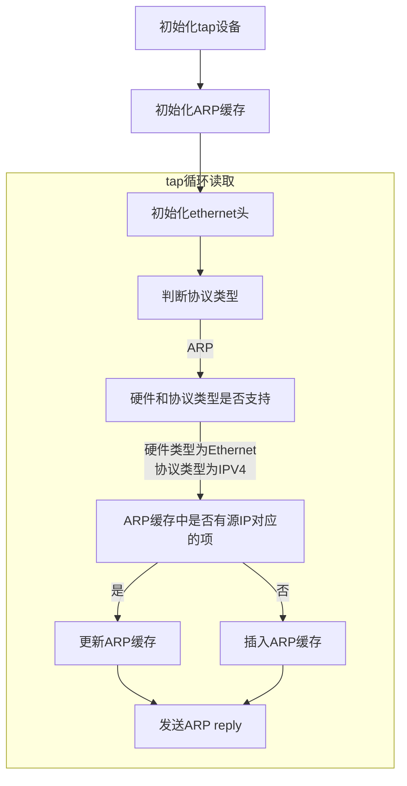

学习网络最好的方式就是实现一个网络栈，毕竟网络不在书本上，仅通过抓包也很难理解网络的全貌。TCP/IP都经过几轮重大改版，想实现完整的网络栈并不容易，但是其核心概念并没有改变，实现最小功能版本的网络栈是可行的，我们将逐步完成这一壮举！
## 环境准备
我们将在linux系统下通过TAP设备实现用户空间的TCP/IP网络栈，需要如下准备
+ 支持tap设备的linux系统，本人安装的是ubuntu20.04.6
+ 安装必要软件，包括
  + gcc，用于编译c程序
  + gdb，用于调试和测试
  + make，项目管理
  + arping，用于发送arp请求
  + git，管理代码版本
  + 编辑器，本人使用vscode结合wsl在windows下进行linux编程
+ 克隆项目 `https://github.com/cafewang/mini-stack.git`
+ `make lvl-ip`构建项目，lvl-ip为可执行文件
+ `make clean`清理项目

项目结构
+ include 头文件目录
+ src 源文件目录
+ tests 测试文件目录
+ build 构建产物目录，placeholder为占位文件，使得git可以提交目录
+ makefile 项目管理文件

## 框架
首先看一下整体流程



我们来依次解释其中的重点

### TAP设备
简单来说，TAP设备让用户空间的程序可以控制L2(数据链路层)/L3(网络层)的流量，我们依赖TAP设备构建L2之上的用户空间网络栈。  
我们在程序中创建tap设备并绑定上路由，用到的命令解释如下
+ `ip link set dev tap0 up`，启动tap0设备
+ `ip route add dev tap0 10.0.0.0/24`，添加路由，将网段10.0.0.0/24的请求发送到tap0设备

### 格式定义
首先，tap设备接收到的是L2的Ethernet帧(网络栈只处理L2的Ethernet协议)，格式如下

```text
struct eth_hdr 
{
    unsigned char dmac[6]; // 目的MAC地址
    unsigned char smac[6]; // 源MAC地址
    uint16_t ethertype; // 上层协议类型，这里只支持ARP
    unsigned char payload[];
} __attribute__((packed));
```
ehternet帧的结构一目了然，这里我们省略了一些未实现的非必要字段，这里需要注意两点
+ `__attribute__((packed))`表示按定义的格式解析结构体，不会加padding改变内部结构
+ 注意网络序和本地序的转换，大于一个字节的类型会转换成本地序，比如ethertype是两个字节，在结构体中是本地序，而linux的枚举定义是网络序，所以需要用`htons`转换

接下来看payload中的ARP结构
```text
struct arp_hdr
{
    uint16_t hwtype; // L2协议类型，这里只支持Ethernet
    uint16_t protype; // L3协议类型，这里只支持IPV4
    unsigned char hwsize; // L2协议大小，Ethernet为MAC地址，6字节
    unsigned char prosize; // L3协议大小，IPV4为IP地址，4字节
    uint16_t opcode;
    unsigned char data[];
} __attribute__((packed));
```
opcode如下
+ 1: ARP request
+ 2: ARP reply
+ 3: RARP request，当前实现中不支持
+ 4: RARP reply，当前实现中不支持

接下来是ARP的payload
```text
struct arp_ipv4
{
    unsigned char smac[6]; // 源MAC地址
    uint32_t sip; // 源IP地址
    unsigned char dmac[6]; // 目的MAC地址
    uint32_t dip; // 目的IP地址
} __attribute__((packed));
```
字段含义都很明确不作引申。

### ARP cache
接收到ARP request之后，需要保存源设备发来的IP和MAC地址，存放在缓存数组中。
```text
struct arp_cache_entry
{
    uint16_t hwtype; // L2协议类型，这里只支持Ethernet
    uint32_t sip; // 源IP
    unsigned char smac[6]; // 源MAC地址
    unsigned int state; // 0表示为空，2表示缓存存在
};
```

更新ARP cache流程如下
+ 遍历cache数组，找到hwype和arp_hdr.hwtype相等，且sip和arp_ipv4.sip相等的项，更新smac
+ 找不到，则插入新记录

### ARP reply
接收到ARP request之后，需要发送ARP reply，将MAC地址通知给源设备，需执行以下步骤
+ 将arp_ipv4中的源、目的IP和MAC地址交换
+ 将本设备的IP和MAC地址写入arp_ipv4的源IP、源MAC地址
+ opcode设为ARP reply
+ ethernet帧中的源MAC地址设为设备MAC地址，目的MAC地址设为源设备的MAC地址
+ 写入TAP设备缓存

## 测试
测试通过gdb脚本实现，由`arping -c1 -I tap0 10.0.0.4`命令触发，含义是`使用设备tap0，向IP10.0.0.4发送一次arp request`。  
测试场景有
+ 发送一次arp请求到10.0.0.4，由于arp cache为空，触发插入cache的操作
+ 发送两次arp请求到10.0.0.4，触发更新cache的操作，更新项ip=10.0.0.4
+ 发送一次arp请求到10.0.0.4，触发回写arp reply的操作