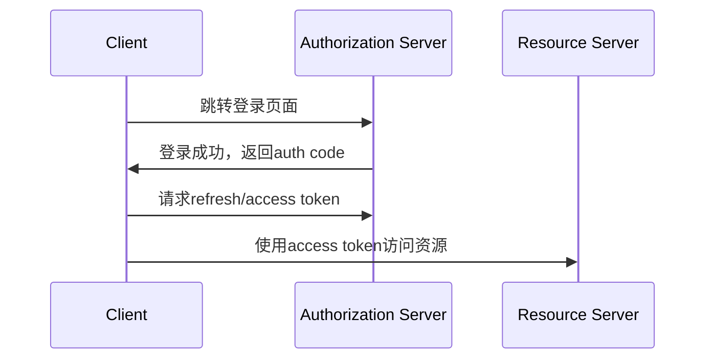
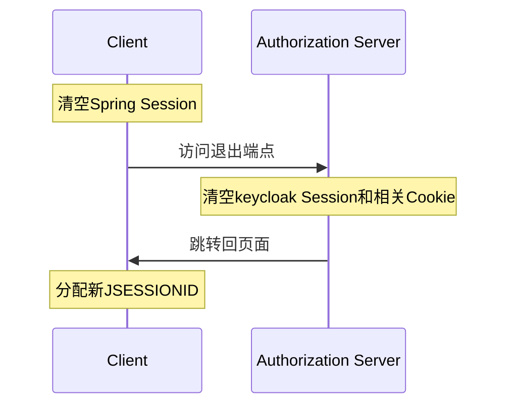

说出来可能让人意外，登录系统可能是最复杂的系统之一，并不是看起来的`注册`、`登录`、`退出`这么简单。  
列举一下登录系统中涉及的重要问题：
+ 密码在前后端怎样存储和验证最安全？
+ 网站的密码复杂度要求高吗？
+ 更改密码时怎样退出其他登录的设备？
+ 怎么保持认证状态，使用session还是JWT？
+ session时长设置成多久比较合适？
+ 多因素认证怎么实现？

看吧，这些问题涉及面太广了，与其实现一个玩具系统，不如研究市面上的成熟框架是怎么解决问题的。  
本文重点讨论单点登录的成熟实现，其他登录相关问题不在讨论范围内。

## 方案选型
我们选择的方案是适用于微服务的`keycloak+spring security oauth2`，下面讲解一下重要概念

### OAuth2
OAuth2是成熟的`授权`方案，注意只是`授权`，不涉及`认证`，要理解OAuth2首先需要明确其中的角色
+ Resource Owner：资源所有者，通常是拥有某个账号的用户
+ Resource Server：待访问的资源，通常是api服务
+ Client：要访问资源的主体，换句话说就是Resource Owner在使用的应用，需要访问Resource Server中的资源
+ Authorization Server：授权服务器，验证Client代表了谁，能做什么事，给Client下发Access Token，使其能访问资源。

  
结合图片理解，用户要通过浏览器浏览网页，用户就是Resource Owner，通过Client浏览器，获取Resource Server上的网页，大体步骤为
+ 用户输入网址并访问，由于没有授权，网页跳转到Authorization Server管理的登录页面
+ 登录成功，Authorization Server返回一个access token，跳转回原页面
+ 页面利用access token访问Resource Server上受保护的资源

可以通过以下场景加深理解
+ 你约了保洁上门打扫，但是临时有事不在家，所以让门房准备了一把备用钥匙，保洁开门后只能打扫，而且必须下午3点前归还钥匙
+ 场景中`你`就是Resource Owner，`保洁`就是Client，`门卫`是Authorization Server，`家`是Resource Service，`备用钥匙`是access key，只能限时访问家里的`打扫资源`(如果算资源的话)

OAuth2有多重授权方式(即获取access token的方式)，对应不同流程和场景，这里我们介绍和使用其中两种
+ 授权码模式(Authorization Code)，适用于用户通过浏览器访问资源的授权
+ 客户端凭证模式(Client Credential)，适用于服务内部授权

### OIDC
全称为OpenID Connect，是基于OAuth2的`认证`规范，它主要负责用户身份在不同主机、设备上的识别、维护，不包括`授权`。  
也就是说，OAuth2和OIDC并不是同类型的规范，它们可以结合使用。

### JWT
JWT就是用非对称加密来传递`明文`的json消息，使得接收方可以通过公钥验证消息来源，而发送方可以通过私钥确认回传的消息没有被篡改。  
json消息分为header和payload两部分，通过base64转码(最后两个字符为-和_，这样可以通过url传输)后用加密算法签名，将三部分一起发送给接收方。  
header和payload都是明文，所以不能传输敏感信息，可以通过[jwt.io](https://jwt.io/)解码，如下图
  
jwt常见携带的信息有用户信息、权限、过期时间。

> 注意  
> jwt是无状态的，从创建之时起就不能修改，直到过期
> 仅使用无状态的jwt代替有状态的session是不可取的，可以看后续内容OAuth2对JWT的使用

### keycloak
keycloak是JBoss公司开发的，支持OAuth2和OIDC以及SAML(微软推出的认证规范)的Authorization Server。  
它的主要功能有维护用户、权限信息，支持授权操作(即给Client发放access token)，非常适合集群上的微服务应用授权。

### Spring Security OAuth2
将springboot应用接入基于OAuth2/OIDC的认证授权流程，应用可以作为Resource Server或Client，甚至是Authorization Server

## 实战项目
克隆项目`https://github.com/cafewang/oauth-sso`
(参考[项目](https://github.com/sivaprasadreddy/spring-security-oauth2-microservices-demo)和[教程](https://www.sivalabs.in/spring-security-oauth2-tutorial-introduction/)，感谢siva大佬的分享)  
运行环境为jdk17，maven3，docker-compose，分为四个服务
+ 运行在docker上的keycloak，在项目路径下执行`docker compose up -d`启动，使用 `admin/admin1234` 登录[控制台](http://localhost:9191)
+ messages-service，作为Resource Server，提供消息创建和查询接口
+ messages-webapp，作为Client，前端页面，展示消息，并提供创建消息、归档消息的入口
+ archival-service，定时执行归档消息的跑批，跑批时作为Client调用messages-service的归档接口，同时作为Resource Server提供触发跑批的入口，演示服务作为两种角色的场景

### 环境准备
#### keycloak配置
首先我们要在keycloak中配置用户、权限、授权流程等信息，都保存在`sivalabs-realm.json`中，可以在控制台查看。
  
realm就是keycloak中的命名空间，用户、角色、权限都属于单独的realm，这里admin用户属于master，而sivalabs是工程realm。  
  
sivalabs中的用户有两个 `siva/siva1234` 和 `prasad/prasad1234`，在应用中登录时都可以使用
  
`ROLE_`开头的角色都是自定义的，在应用中会用到，后面三个是系统权限，无需关注
  
重头戏来了，这就是OAuth2规范中的Client，黄框中的两个应用是我们自定义的，其他的是系统相关的  
来看看Client中最重要的一部分配置
  
这里是archival-service的Client配置，采用的流程是`客户端凭证`
+ Client authentication选中表示Client是服务端应用，置空表示客户端应用
+ authorization即授权，不在本文讨论范畴，这里关闭即可
+ Authentication flow，选择Client支持的认证流程
    + Standard flow即授权码模式
    + Service accounts roles即客户端凭证

授权码模式需要设置`redirect uri`，即登录完成跳转回的页面。  
还可以设置`log out redirect uri`，即退出后跳转的页面，前端跳转到其他页面会报错。
  
还有Client凭证，在认证流程中会用到
  
其余配置在用到时再讲解。

### Resource server配置
我们来看看messages-service作为Resource server是怎么配置的
```properties
# application.properties
spring.application.name=messages-service
server.port=8181
OAUTH_SERVER=http://localhost:9191/realms/sivalabs
spring.security.oauth2.resourceserver.jwt.issuer-uri=${OAUTH_SERVER}
```
由于Resource server不需要在Authorization server上注册，只需要配置issuer-uri，OAuth2客户端在地址后拼接`/.well-known/openid-configuration`能得到重要的api端口，后面我们会用到
  

下面是核心的配置逻辑
```java
@Configuration
@EnableWebSecurity
public class SecurityConfig {

    @Bean
    SecurityFilterChain securityFilterChain(HttpSecurity http) throws Exception {
        http
            .authorizeHttpRequests(c ->
                c
                    .requestMatchers(HttpMethod.GET, "/api/messages").permitAll()
                    .requestMatchers(HttpMethod.POST, "/api/messages/archive").hasAnyRole("ADMIN", "ADMIN_JOB")
                    .anyRequest().authenticated()
            )
            .sessionManagement(c -> c.sessionCreationPolicy(SessionCreationPolicy.STATELESS))
            .cors(CorsConfigurer::disable)
            .csrf(CsrfConfigurer::disable)
            .oauth2ResourceServer(oauth2 ->
                oauth2.jwt(jwt -> jwt.jwtAuthenticationConverter(new KeycloakJwtAuthenticationConverter()))
            );
        return http.build();
    }
}
```
+ 权限控制，GET的`/api/messages`方法没有限制，POST的`/api/messages/archive`方法只有ADMIN、ADMIN_JOB两个角色能访问，其余接口登录后才能访问
+ session设置为不创建，因为服务是纯后端
+ cors和csrf为网络攻击相关设置
+ KeycloakJwtAuthenticationConverter将自定义的`ROLE_`开头的角色添加到权限里

### Client配置
```properties
OAUTH_SERVER=http://localhost:9191/realms/sivalabs

spring.security.oauth2.client.registration.messages-webapp.client-id=messages-webapp
spring.security.oauth2.client.registration.messages-webapp.client-secret=qVcg0foCUNyYbgF0Sg52zeIhLYyOwXpQ
spring.security.oauth2.client.registration.messages-webapp.authorization-grant-type=authorization_code
spring.security.oauth2.client.registration.messages-webapp.scope=openid, profile
spring.security.oauth2.client.registration.messages-webapp.redirect-uri={baseUrl}/login/oauth2/code/messages-webapp

spring.security.oauth2.client.provider.messages-webapp.issuer-uri=${OAUTH_SERVER}
```
messages-webapp作为Client需要配置registration和provider两块
registration
+ client id和secret组成凭证，从keycloak配置中获取
+ authorization-grant-type即认证流程，必须在keycloak中勾选，这里是授权码模式
+ scope即认证结果附加的信息，profile为基本信息
+ redirect-uri即跳转地址，必须和keycloak上配置一致
provider即Authorization Server的信息，这里就是keycloak的realm地址

```java
@Configuration
@EnableWebSecurity
public class SecurityConfig {
    private final ClientRegistrationRepository clientRegistrationRepository;

    public SecurityConfig(ClientRegistrationRepository clientRegistrationRepository) {
        this.clientRegistrationRepository = clientRegistrationRepository;
    }

    @Bean
    SecurityFilterChain securityFilterChain(HttpSecurity http) throws Exception {
        http
            .authorizeHttpRequests(c ->
                    c.requestMatchers("/").permitAll()
                    .anyRequest().authenticated()
            )
            .cors(CorsConfigurer::disable)
            .csrf(CsrfConfigurer::disable)
            .oauth2Login(oauth2 ->
                oauth2.userInfoEndpoint(userInfo -> userInfo
                        .userAuthoritiesMapper(new KeycloakAuthoritiesMapper())))
            .logout(logout -> logout
                    .clearAuthentication(true)
                    .invalidateHttpSession(true)
                    .logoutSuccessHandler(oidcLogoutSuccessHandler())
            );
        return http.build();
    }

    private LogoutSuccessHandler oidcLogoutSuccessHandler() {
        OidcClientInitiatedLogoutSuccessHandler oidcLogoutSuccessHandler =
                new OidcClientInitiatedLogoutSuccessHandler(this.clientRegistrationRepository);
        oidcLogoutSuccessHandler.setPostLogoutRedirectUri("{baseUrl}/");
        return oidcLogoutSuccessHandler;
    }
}
```
+ 除了访问根路径`/`都需要认证
+ KeycloakAuthoritiesMapper同上，也是将`ROLE_`开头的角色添加到权限中
+ 设置退出时清空认证和session，并设置跳转地址

#### 项目启动
启动完keycloak，文件导入完即配置完成，不需要手动修改，然后分别启动三个服务即可。  
前端入口为`http://localhost:8080`
  
初始登录时未认证，只能查看消息列表，不能新增或归档，右上角有登录按钮。

## 授权码模式
### 登录
我们进入首页后点击右上角登录，看看每一步都发生了什么  
+ 点击登录按钮，对应请求为`http://localhost:8080/oauth2/authorization/messages-webapp` ，地址是OAuth2框架生成的，未授权时会跳转到登录页面  
可以看到跳转地址为`http://localhost:9191/realms/sivalabs/protocol/openid-connect/auth` ，为Authorization Server获取auth_code的端点，参数为
  + response_type=code，auth_code类型，还有其他的
  + client_id=messages-webapp
  + scope=openid profile，除了profile基本信息，还加上openid获取其他用户信息
  + redirect_uri=http://localhost:8080/login/oauth2/code/messages-webapp 跳转回的地址
      
+ 在登录页面，点击登录按钮，请求为`http://localhost:9191/realms/sivalabs/login-actions/authenticate`  ，  
重定向到`http://localhost:8080/login/oauth2/code/messages-webapp` 主要参数为
  + code=115b0a30-855f-4208-943f-0157a2b83c75.f9feeaa5-8269-49fc-9074-4e1a4739d67e.27a26554-da99-417c-a775-bf6559c98f02
  + 可以看到跳转回了应用，并返回auth_code，后续就需要用auth_code来申请access code
      
     
+ 现在又跳转回了应用，并且得到了auth_code，这时spring security OAuth2就会用auth_code请求获取access code的端点，我们debug`org.springframework.security.oauth2.client.endpoint.DefaultAuthorizationCodeTokenResponseClient#getTokenResponse`这个方法
  + 请求包含code，即前面得到的auth_code
      
  + 响应包含access code和refresh code，refresh code过期时间长，可以通过它重新获取access code，它们的格式都是JWT
    
  + 后续Spring Security OAuth2就会管理refresh code和access code，按需进行刷新
+ 请求结束后，跳转回登录前的页面，这时已经完成认证流程，可以访问Resource Server上的资源了
  



### 退出
登录完就可以看到新增和归档消息的入口了，右上角也变为了logout。  

来看看登录后的session  

可以看到session的属性中包含了`SPRING_SECURITY_CONTEXT`，其中包含用户信息、权限和登录状态
+ 我们点击logout，请求为`http://localhost:8080/logout` ，这个也是Spring Security创建的端点，它的操作有
  + 将Spring Session清空，JSESSIONID无效化
  + 清空认证状态
  + 最后调用Authorization Server的退出端点`http://localhost:9191/realms/sivalabs/protocol/openid-connect/logout`
    
+ Authorization Server退出端点会清空keycloak的session和浏览器相关Cookie，然后跳转回页面  
  
+ 回到页面后原JSESSIONID已经无效，服务端分配了新ID
  



### 访问
下面通过messages-webapp访问messages-service的新增消息接口演示授权码的应用。
+ 请求打到messages-webapp对应接口，首先通过`OAuth2AuthorizedClientService.loadAuthorizedClient`获取`OAuth2AuthorizedClient`，后面的类中管理着refresh token和access token
  
+ 将access token置入header`Authorization`中，就能访问到messages-service的新增消息接口
  

## 客户端凭证
客户端凭证不需要User的介入，适合服务端之间的通信，我们以archival-service调用messages-service的归档接口为例演示。
+ archival-service想调用messages-service的`/api/messages/archive`接口，首先需要获取access token
+ 拦截`DefaultClientCredentialsTokenResponseClient#getTokenResponse`方法，可以访问了Authorization Server的端点，需要注意的是header中的`Authorization`，包含了ClientId/ClientSecret的base64编码
  
+ 然后archival-service可以使用结果中的access token访问归档接口

## SSO
做完大量铺垫，终于来到正题了，SSO(Single Sign-On/Off)即单点登录(退出)可以通过keycloak+Spring Security OAuth2来实现
+ 首先我们新增一个服务messages-apptwo，代码和messages-webapp相同，区别如下
  + 端口设为8585，messages-webapp为8080
  + Client仍使用messages-webapp，但是跳转地址加上了apptwo的地址
    
+ 为了让webapp和apptwo两个服务共享session，我们引入redis管理session
  + 首先在docker compose文件中加入redis服务，端口为6379
  + 在两个服务中加入`spring-session-data-redis`和`spring-boot-starter-data-redis`依赖
  + 在两个服务中加入配置
```properties
spring.redis.host=localhost
spring.redis.port=6379
spring.session.store-type=redis
```

### 同域名登录/退出
+ 在同一浏览器中访问`http://localhost:8080`和`http://localhost:8585`，都是未登录状态，cookie中`SESSION=ODdlZmJiN2UtMDNmYy00ZGVkLWE3OWEtNmQxZTdkZjdiZDc3`，base64解码为`87efbb7e-03fc-4ded-a79a-6d1e7df7bd77`
+ 在redis-cli中查找全部hash，能找到对应session
  
+ 在`http://localhost:8080`上登录，仍是标准的授权码模式流程，登录成功后cookie中`SESSION=MDgwZmFiNmQtMDVjOS00NGZhLTg5ZjUtNmFmZGZjZDYxNTFk`，base64解码为`080fab6d-05c9-44fa-89f5-6afdfcd6151d`，在redis-cli中可以查询到
+ 切换到`http://localhost:8585`，刷新页面，由于请求头带有`SESSION=MDgwZmFiNmQtMDVjOS00NGZhLTg5ZjUtNmFmZGZjZDYxNTFk`，直接获取到已登录session，没有走认证流程
+ 从页面`http://localhost:8585`退出，流程和之前并没有区别，返回新的header`SESSION=YzdlNWQyZDEtMmViNC00NTJhLWEzOGQtNTI0MzVkZGM1OGYx`
+ 刷新页面`http://localhost:8080`，请求头为`SESSION=YzdlNWQyZDEtMmViNC00NTJhLWEzOGQtNTI0MzVkZGM1OGYx`，所以是未登录状态

### session管理
上述的同域名SSO中存在两个session
+ 未登录时，只有spring维护在redis中的session，对应cookie`SESSION`，可以在redis-cli中查到
+ 登录后，有两个session
  + spring维护在redis中的session，包含`SPRING_SECURITY_CONTEXT`，即用户信息、权限等属性
  + keycloak中的session，即用户通过授权码模式登录的状态
    
+ 从页面退出会无效旧的cookie`SESSION`，返回一个新的未登录的cookie，并且会退出keycloak的session
+ 如果只退出了keycloak的session，spring session仍是登录状态，但这时已经无法访问Resource Server的资源了(会返回401)，需要主动退出登录或清理cookie
