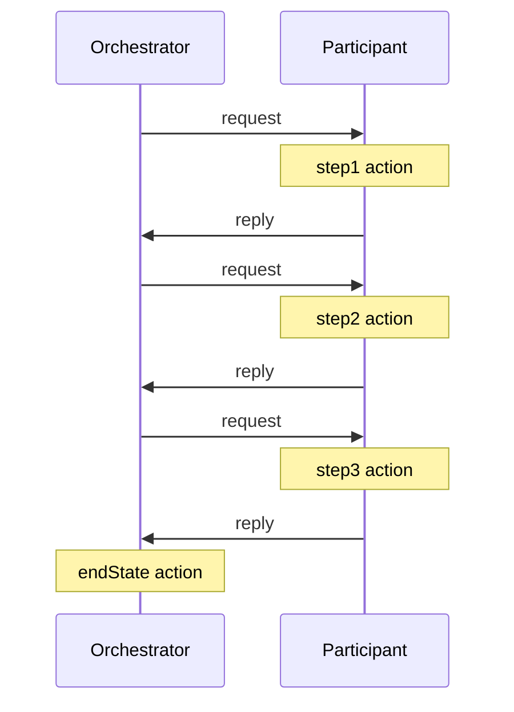
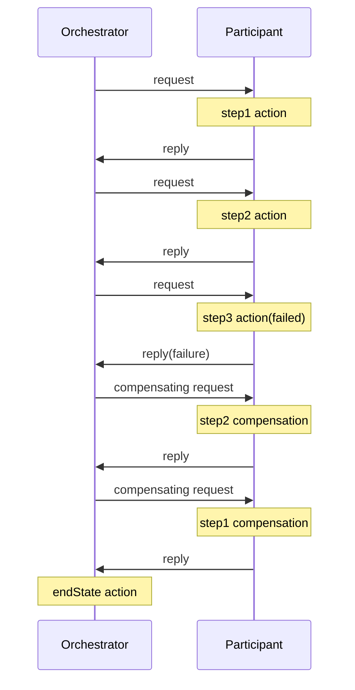

本文以`微服务设计模式`书中的demo项目`ftgo-application`为例，讲解sagas模式在微服务架构中的具体实现。  
文中不会专门讲解sagas的概念，而是在演示过程中穿插解释sagas是什么，在阅读和操练项目的过程中，您会加深对sagas的理解，同时也能学到sagas的落地方式。

## 项目准备
首先克隆`https://github.com/cafewang/ftgo-application` 项目，是`Chris Richardson`原项目的fork，项目包含如下模块
+ 基础架构
  + mysql，存储业务数据和sagas状态
  + zookeeper，被kafka和cdc-service使用
  + kafka，用于sagas中的通信
  + kafka-gui，查看消息内容
  + zipkin，分布式链路追踪
  + dynamodblocal，本地的nosql数据库，用于CQRS
  + dynamodblocal-init，用于初始化数据库，创建相关表
+ 服务
  + ftgo-api-gateway，服务网关
  + cdc-service，服务于eventuate-tram组件，实现outbox pattern
  + ftgo-order-service，订单服务，也是sagas的组织者
  + ftgo-order-history-service，订单历史服务，使用eventuate-tram实现CQRS
  + ftgo-consumer-service，顾客服务
  + ftgo-accounting-service，账户服务，使用eventuate-local用event-sourcing实现Account
  + ftgo-restaurant-service，餐厅服务
  + ftgo-kitchen-service，厨房服务
  + ftgo-delivery-service，送餐服务

环境要求
+ 使用Idea导入项目，项目由gradle管理，会自动下载
+ 使用jdk8
+ 保证本地有已启动的docker环境(包含docker compose)，使用`gradle :composeUp`命令启动所有服务
+ 使用`gradle :composeDown`关闭所有服务
+ k8s部署请参考项目的readme

主要依赖
+ springboot，微服务框架
+ spring-data-JPA，ORM框架
+ eventuate-tram，实现服务间的异步通信，基于消息队列(kafka)和outbox模式
+ eventuate-sagas，基于eventuate-tram实现sagas
+ eventuate-local，event-sourcing框架

## 订单创建
### 创建Consumer
+ 打开cusotomer-service的swagger`http://localhost:8081/swagger-ui/index.html` ，调用创建接口
+ 连接数据库(端口为3306，root / rootpassword)，查看customers表，创建了id=1的顾客  


#### 领域事件发布
查看创建customer的接口，位于CustomerService
```java
  @Transactional
  public ResultWithEvents<Consumer> create(PersonName name) {
      ResultWithEvents<Consumer> rwe = Consumer.create(name);
      consumerRepository.save(rwe.result);
      domainEventPublisher.publish(Consumer.class, rwe.result.getId(), rwe.events);
      return rwe;
  }
```

重点关注`publish`操作，使用`code graph`插件，一路追踪到`MessageProducerImpl.send`方法

```java
    protected void send(Message message) {
        this.preSend(message);

        try {
            this.implementation.send(message);
            this.postSend(message, (RuntimeException)null);
        } catch (RuntimeException e) {
            this.logger.error("Sending failed", e);
            this.postSend(message, e);
            throw e;
        }
    }
```

+ `preSend`和`postSend`是拓展点，无需关注，重点是`this.implementation.send`
+ 其实现是`MessageProducerJdbcImpl.send`，可以看到是向Message表中插入一条记录

```java
    @Override
    public void send(Message message) {
        String id =  eventuateCommonJdbcOperations.insertIntoMessageTable(idGenerator,
                  message.getPayload(),
                  message.getRequiredHeader(Message.DESTINATION),
                  message.getHeaders(),
                  eventuateSchema);
    
        message.setHeader(Message.ID, id);
    }
```

+ 查看Message表，字段如下
  
```json
{
    "PARTITION_ID": "1",
    "event-aggregate-type": "net.chrisrichardson.ftgo.consumerservice.domain.Consumer",
    "DATE": "Sat, 26 Apr 2025 15:37:42 GMT",
    "event-aggregate-id": "1",
    "event-type": "net.chrisrichardson.ftgo.consumerservice.domain.ConsumerCreated",
    "DESTINATION": "net.chrisrichardson.ftgo.consumerservice.domain.Consumer",
    "ID": "0000019672bf4f6d-8e7a23b4ef820000"
}
```
  + 消息id，是生成器生成的，全局唯一
  + destination，对应消息存储的channel，kafka中就是topic
  + headers，type对应事件类型，aggregate-id对应业务id，这里是cusomer id，aggregate-type是聚合类型，也对应消息channel
  + payload，负载，这里为空
  + published
  + creationTime
+ 登录kafka-gui，`http://localhost:9088/` 查看topic`net.chrisrichardson.ftgo.consumerservice.domain.Consumer`，可以看到一条消息
  

总结一下，领域事件发布流程如下
  + publish方法将领域事件（这里是ConsumerCreated）保存为Message表中的记录
  + cdc-service获取到binlog，向destination的topic中发送消息

#### 领域事件接收
注册：在`AccountingMessagingConfiguration`类中，`DomainEventDispatcher`作为接收方接收并路由领域事件
```java
    @Bean
    public DomainEventDispatcher domainEventDispatcher(AccountingEventConsumer accountingEventConsumer, DomainEventDispatcherFactory domainEventDispatcherFactory) {
        return domainEventDispatcherFactory.make("accountingServiceDomainEventDispatcher", accountingEventConsumer.domainEventHandlers());
    }
```
处理：在类`AccountingEventConsumer`中定义了处理方法，接收的topic由aggregateType指定，事件类型由header中eventType指定，这里为`net.chrisrichardson.ftgo.consumerservice.domain.ConsumerCreated`  
收到`ConsumerCreated`事件后会以event-sourcing的方式创建account，这里不展开

```java
  public DomainEventHandlers domainEventHandlers() {
    return DomainEventHandlersBuilder
            .forAggregateType("net.chrisrichardson.ftgo.consumerservice.domain.Consumer")
            .onEvent(ConsumerCreated.class, this::createAccount) 
            .build();
  }

  private void createAccount(DomainEventEnvelope<ConsumerCreated> dee) {
    accountingService.create(dee.getAggregateId());
  }
```


### 创建Restaurant
打开swagger`http://localhost:8084/swagger-ui/index.html` ，调用创建接口
```json
{
    "address": {
        "city": "string",
        "state": "string",
        "street1": "string",
        "street2": "string",
        "zip": "string"
    },
    "menu": {
        "menuItems": [
            {
                "id": "1",
                "name": "沙拉",
                "price": "10"
            },
            {
                "id": "2",
                "name": "披萨",
                "price": "20"
            }
        ]
    },
    "name": "安妮餐厅"
}
```

查询数据库`ftgo-restaurant-service`，查看restaurant表和menu_items表中新建的记录  
  
  
同样创建Restaurant会触发`RestaurantCreated`领域事件，可以在Message表和kafka中查看到  
  
    

### 创建Order
#### 本地化
order-service会备份restaurant和menuItem信息，监听`RestaurantCreated`和`RestaurantMenuRevised`事件。  
这种冗余变化不频繁的外部数据的方式经常在微服务中使用。

```java
  public DomainEventHandlers domainEventHandlers() {
    return DomainEventHandlersBuilder
            .forAggregateType("net.chrisrichardson.ftgo.restaurantservice.domain.Restaurant")
            .onEvent(RestaurantCreated.class, this::createMenu)
            .onEvent(RestaurantMenuRevised.class, this::reviseMenu)
            .build();
  }
```

#### 创建接口
创建接口在`OrderService`中
```java
  @Transactional
  public Order createOrder(long consumerId, long restaurantId, DeliveryInformation deliveryInformation,
                           List<MenuItemIdAndQuantity> lineItems) {
    Restaurant restaurant = restaurantRepository.findById(restaurantId)
            .orElseThrow(() -> new RestaurantNotFoundException(restaurantId));

    List<OrderLineItem> orderLineItems = makeOrderLineItems(lineItems, restaurant);

    ResultWithDomainEvents<Order, OrderDomainEvent> orderAndEvents =
            Order.createOrder(consumerId, restaurant, deliveryInformation, orderLineItems);

    Order order = orderAndEvents.result;
    orderRepository.save(order);

    orderAggregateEventPublisher.publish(order, orderAndEvents.events);

    OrderDetails orderDetails = new OrderDetails(consumerId, restaurantId, orderLineItems, order.getOrderTotal());

    CreateOrderSagaState data = new CreateOrderSagaState(order.getId(), orderDetails);
    sagaInstanceFactory.create(createOrderSaga, data);
    return order;
  }
```
做了这几件事
+ 查询Restaurant以组装OrderLineItem
+ 保存order(初始状态为`APPROVAL_PENDING`，订单状态后续会专门讲解)，发布领域事件`OrderCreatedEvent`
+ 组装sagas状态并启动`CreateOrderSaga`

领域事件我们前面已经讲过，下面进入主题sagas的讲解

#### CreateOrderSaga
首先看定义sagas的方法签名

```java
  public CreateOrderSaga(OrderServiceProxy orderService, ConsumerServiceProxy consumerService, KitchenServiceProxy kitchenService,
                         AccountingServiceProxy accountingService) {}
```

可以看到有很多Proxy，这些都是定义Command的类

##### Command定义
Command-Reply是eventuate-tram中实现的一种异步交互方式
+ 服务A通过channel发送command到服务B
+ 服务B将结果通过channel返回给服务A

来看`OrderServiceProxy`中的定义
```java
  public final CommandEndpoint<RejectOrderCommand> reject = CommandEndpointBuilder
          .forCommand(RejectOrderCommand.class)
          .withChannel(OrderServiceChannels.COMMAND_CHANNEL)
          .withReply(Success.class)
          .build();

  public final CommandEndpoint<ApproveOrderCommand> approve = CommandEndpointBuilder
          .forCommand(ApproveOrderCommand.class)
          .withChannel(OrderServiceChannels.COMMAND_CHANNEL)
          .withReply(Success.class)
          .build();
```
这里定义了orderService要处理的两类命令，reject和approve
+ forCommand定义命令类型
+ withChannel定义通信的channel，即topic
+ withReply定义返回的结果，有Success/Failure两种

命令接收逻辑如下
```java
// OrderCommandHandlersConfiguration
@Bean
public SagaCommandDispatcher orderCommandHandlersDispatcher(OrderCommandHandlers orderCommandHandlers, SagaCommandDispatcherFactory sagaCommandDispatcherFactory) {
  return sagaCommandDispatcherFactory.make("orderService", orderCommandHandlers.commandHandlers());
}
// OrderCommandHandlers
public CommandHandlers commandHandlers() {
    return SagaCommandHandlersBuilder
            .fromChannel("orderService")
            .onMessage(ApproveOrderCommand.class, this::approveOrder)
            .onMessage(RejectOrderCommand.class, this::rejectOrder).build();
}
```
注册SagaCommandDispatcher绑定对命令的处理逻辑，CommandHandlers中包含命令进入的channel和不同命令的处理逻辑，返回的channel在命令中定义。

##### sagas定义
```java
// CreateOrderSaga
public CreateOrderSaga(OrderServiceProxy orderService, ConsumerServiceProxy consumerService, KitchenServiceProxy kitchenService,
                       AccountingServiceProxy accountingService) {
  this.sagaDefinition =
          step()
          .withCompensation(orderService.reject, CreateOrderSagaState::makeRejectOrderCommand)
          .step()
          .invokeParticipant(consumerService.validateOrder, CreateOrderSagaState::makeValidateOrderByConsumerCommand)
          .step()
          .invokeParticipant(kitchenService.create, CreateOrderSagaState::makeCreateTicketCommand)
          .onReply(CreateTicketReply.class, CreateOrderSagaState::handleCreateTicketReply)
          .withCompensation(kitchenService.cancel, CreateOrderSagaState::makeCancelCreateTicketCommand)
          .step()
          .invokeParticipant(accountingService.authorize, CreateOrderSagaState::makeAuthorizeCommand)
          .step()
          .invokeParticipant(kitchenService.confirmCreate, CreateOrderSagaState::makeConfirmCreateTicketCommand)
          .step()
          .invokeParticipant(orderService.approve, CreateOrderSagaState::makeApproveOrderCommand)
          .build();
}
// CreateOrderSagaState
RejectOrderCommand makeRejectOrderCommand() {
  return new RejectOrderCommand(getOrderId());
}
```
我们预期的效果是，step1执行完就去执行step2，然后是step3，如果任何一步执行失败，会执行之前每一步的withCompensation操作，按相反的顺序。  
先看看step()定义
```java
// SimpleSagaDefinitionBuilder
private List<SagaStep<Data>> sagaSteps = new LinkedList<>();

public void addStep(SagaStep<Data> sagaStep) {
  sagaSteps.add(sagaStep);
}

public SagaDefinition<Data> build() {
  return new SimpleSagaDefinition<>(sagaSteps);
}
// SimpleSagaDsl
default StepBuilder<Data> step() {
  SimpleSagaDefinitionBuilder<Data> builder = new SimpleSagaDefinitionBuilder<>();
  return new StepBuilder<>(builder);
}
// StepBuilder
private final SimpleSagaDefinitionBuilder<Data> parent;

public StepBuilder(SimpleSagaDefinitionBuilder<Data> builder) {
  this.parent = builder;
}

public LocalStepBuilder<Data> invokeLocal(Consumer<Data> localFunction) {
  return new LocalStepBuilder<>(parent, localFunction);
}

public InvokeParticipantStepBuilder<Data> invokeParticipant(Function<Data, CommandWithDestination> action) {
  return new InvokeParticipantStepBuilder<>(parent).withAction(Optional.empty(), action);
}

@Override
public InvokeParticipantStepBuilder<Data> withCompensation(Function<Data, CommandWithDestination> compensation) {
  return new InvokeParticipantStepBuilder<>(parent).withCompensation(compensation);
}
```
首先SimpleSagaDefinitionBuilder中包含SagaStep的列表，SagaStep有两种类型
+ LocalStep，表示本地操作，不用发送消息
  + Consumer<Data> localFunction，本地操作
  + Optional<Consumer<Data>> compensation，补偿操作
+ ParticipantInvocationStep，表示Command-Reply形式的远程操作
  + Optional<ParticipantInvocation<Data>> participantInvocation，远程操作，包含要发送的Command
  + Optional<ParticipantInvocation<Data>> compensation，补偿操作
  + Map<String, BiConsumer<Data, Object>> actionReplyHandlers # todo
  + Map<String, BiConsumer<Data, Object>> compensationReplyHandlers # todo
      
再回到上面CreateOrderSaga的定义，所有的step都是ParticipantInvocationStep

| **step** | **action**                    | **compensation**      |
|----------|-------------------------------|-----------------------|
| 1        |                               | orderService.reject   |
| 2        | consumerService.validateOrder |                       |
| 3        | kitchenService.create         | kitchenService.cancel |
| 4        | accountingService.authorize   |                       |
| 5        | kitchenService.confirmCreate  |                       |
| 6        | orderService.approve          |                       |

##### sagas执行
大概了解了CreateOrderSaga的定义，下面我们看看具体的执行流程
sagas入口在OrderService的createOrder方法中
```java
    CreateOrderSagaState data = new CreateOrderSagaState(order.getId(), orderDetails);
    sagaInstanceFactory.create(createOrderSaga, data);
```
CreateOrderSagaState存储saga的状态，在这里就是订单详情。  
SagaInstanceFactory是我们研究的重点
```java
// SagaOrchestratorConfiguration
@Bean
public SagaInstanceFactory sagaInstanceFactory(SagaInstanceRepository sagaInstanceRepository, CommandProducer
                                                       commandProducer, MessageConsumer messageConsumer,
                                               SagaLockManager sagaLockManager, SagaCommandProducer sagaCommandProducer, Collection<Saga<?>> sagas) {
  SagaManagerFactory smf = new SagaManagerFactory(sagaInstanceRepository, commandProducer, messageConsumer,
          sagaLockManager, sagaCommandProducer);
  return new SagaInstanceFactory(smf, sagas);
}
// SagaInstanceFactory
private ConcurrentMap<Saga<?>, SagaManager<?>> sagaManagers = new ConcurrentHashMap<>();

public SagaInstanceFactory(SagaManagerFactory sagaManagerFactory, Collection<Saga<?>> sagas) {
  for (Saga<?> saga : sagas) {
    sagaManagers.put(saga, makeSagaManager(sagaManagerFactory, saga));
  }
}

public <SagaData> SagaInstance create(Saga<SagaData> saga, SagaData data) {
  SagaManager<SagaData>  sagaManager = (SagaManager<SagaData>)sagaManagers.get(saga);
  if (sagaManager == null)
    throw new RuntimeException(("No SagaManager for " + saga));
  return sagaManager.create(data);
}

private <SagaData> SagaManager<SagaData> makeSagaManager(SagaManagerFactory sagaManagerFactory, Saga<SagaData> saga) {
  SagaManagerImpl<SagaData> sagaManager = sagaManagerFactory.make(saga);
  sagaManager.subscribeToReplyChannel();
  return sagaManager;
}
```
SagaInstanceFactory由自动配置注入，会扫描所有Saga类，每个类创建一个SagaManager。  
SagaManager负责saga流程的创建和监听并处理Reply。

```java
// SagaManagerImpl
  @Override
  public SagaInstance create(Data sagaData, Optional<String> resource) {
    SagaInstance sagaInstance = new SagaInstance(getSagaType(),
            null,
            "????",
            null,
            SagaDataSerde.serializeSagaData(sagaData), new HashSet<>());
    sagaInstanceRepository.save(sagaInstance);
    String sagaId = sagaInstance.getId();

    SagaActions<Data> actions = getStateDefinition().start(sagaData);
    actions.getLocalException().ifPresent(e -> {
      throw e;
    });

    processActions(saga.getSagaType(), sagaId, sagaInstance, sagaData, actions);
    return sagaInstance;
  }
```
这里我们删除一些不关注的代码，sagas创建涉及这几部分
+ 创建SagaInstance并落库
+ 将SagaDefinition转为SagaActions并执行

具体的执行过程在第二步，首先是SagaActions的转换
```java
// SimpleSagaDefinition
@Override
public SagaActions<Data> start(Data sagaData) {
  return toSagaActions(firstStepToExecute(sagaData));
}
// AbstractSimpleSagaDefinition
protected Provider firstStepToExecute(Data data) {
  return nextStepToExecute(SagaExecutionState.startingState(), data);
}
//
public class SagaExecutionState {
    private int currentlyExecuting;
    private boolean compensating;
    private boolean endState;
    private boolean failed;

    public static SagaExecutionState startingState() {
        return new SagaExecutionState(-1, false);
    }
}
```
SagaExecutionState对应sagas执行到的下标，假设共有n步，则下标范围是$$[1,n-1]$$  
currentlyExecuting初始为-1，初始时，compensating为false，每次+1，执行失败时，compensating设为true，反向执行每次-1。
```java
// AbstractSimpleSagaDefinition
protected Provider nextStepToExecute(SagaExecutionState state, Data data) {
    int skipped = 0;
    boolean compensating = state.isCompensating();
    int direction = compensating ? -1 : +1;
    for (int i = state.getCurrentlyExecuting() + direction; i >= 0 && i < steps.size(); i = i + direction) {
        Step step = steps.get(i);
        if ((compensating ? step.hasCompensation(data) : step.hasAction(data))) {
            ToExecute stepToExecute = makeStepToExecute(skipped, compensating, step);
            return makeSagaActionsProvider(stepToExecute, data, state);
        } else
            skipped++;
    }
    return makeSagaActionsProvider(makeEndStateSagaActions(state));
}
```
如上所述，获取下一步执行的操作，根据以下条件
+ compensating决定下标移动的方向
+ 如果当前Step没有对应操作(hasAction/hasCompensation)，跳过该Step
+ 如果所有Step执行完，成功则下标为steps.size()，失败则为-1，执行makeEndStateSagaActions 

来具体看一下makeSagaActionsProvider，这个方法非常关键
```java
// AbstractSimpleSagaDefinition.nextStepToExecute
makeSagaActionsProvider(stepToExecute, data, state);
// SimpleSagaDefinition
protected SagaActionsProvider<Data> makeSagaActionsProvider(StepToExecute<Data> stepToExecute, Data data, SagaExecutionState state) {
  return new SagaActionsProvider<>(() -> stepToExecute.executeStep(data, state));
}
// StepToExecute
public SagaActions<Data> executeStep(Data data, SagaExecutionState currentState) {
  SagaExecutionState newState = currentState.nextState(size());
  SagaActions.Builder<Data> builder = SagaActions.builder();
  boolean compensating = currentState.isCompensating();

  step.makeStepOutcome(data, this.compensating).visit(builder::withIsLocal, builder::withCommands);

  return makeSagaActions(builder, data, newState, compensating);
}
// LocalStep
public StepOutcome makeStepOutcome(Data data, boolean compensating) {
  try {
    if (compensating) {
      compensation.ifPresent(localStep -> localStep.accept(data));
    } else {
      localFunction.accept(data);
    }
    return makeLocalOutcome(Optional.empty());
  } catch (RuntimeException e) {
    return makeLocalOutcome(Optional.of(e));
  }
}
// ParticipantInvocationStep
public StepOutcome makeStepOutcome(Data data, boolean compensating) {
  return StepOutcome.makeRemoteStepOutcome(getParticipantInvocation(compensating)
          .map(x -> x.makeCommandToSend(data))
          .map(Collections::singletonList)
          .orElseGet(Collections::emptyList));
}
```
可以看到SagaActionsProvider内部执行了executeStep，又执行了makeStepOutcome，将结果保存到SagaActions中
+ LocalStep在makeStepOutcome时就已经执行了localFunction，并保存出现的异常
+ ParticipantInvocationStep只是生成了要发送的Command，并没有实际执行

回到start方法
```java
// SimpleSagaDefinition
public SagaActions<Data> start(Data sagaData) {
  return toSagaActions(firstStepToExecute(sagaData));
}

private SagaActions<Data> toSagaActions(SagaActionsProvider<Data> sap) {
  return sap.toSagaActions(identity(), identity());
}
// AbstractSagaActionsProvider
private final SagaActions<Data> sagaActions;
private final Supplier<SuppliedValue> sagaActionsSupplier;
public SuppliedValue toSagaActions(Function<SagaActions<Data>, SuppliedValue> f1, Function<SuppliedValue, SuppliedValue> f2) {
  return sagaActions != null ? f1.apply(sagaActions) : f2.apply(sagaActionsSupplier.get());
}
```
可以看到makeSagaActionsProvider返回的SagaActionsProvider包含两个字段
+ sagaActionsSupplier，对应本地和远程操作，`sagaActionsSupplier.get()`会触发executeStep的执行
+ sagaActions，对应endState或Reply异常的step

现在清楚了，start执行完，如果是LocalStep，其操作已经执行，所以会检查是否报错，下面进入saga执行的主流程
```java
// SagaManagerImpl
SagaActions<Data> actions = getStateDefinition().start(sagaData);
actions.getLocalException().ifPresent(e -> { throw e; });
processActions(saga.getSagaType(), sagaId, sagaInstance, sagaData, actions);

private void processActions(String sagaType, String sagaId, SagaInstance sagaInstance, Data sagaData, SagaActions<Data> actions) {
    while (true) {
    if (actions.getLocalException().isPresent()) {
      actions = getStateDefinition().handleReply(sagaType, sagaId, actions.getUpdatedState().get(), actions.getUpdatedSagaData().get(), MessageBuilder
              .withPayload("{}")
              .withHeader(ReplyMessageHeaders.REPLY_OUTCOME, CommandReplyOutcome.FAILURE.name())
              .withHeader(ReplyMessageHeaders.REPLY_TYPE, Failure.class.getName())
              .build());
    } else {
      // only do this if successful
      String lastRequestId = sagaCommandProducer.sendCommands(this.getSagaType(), sagaId, actions.getCommands(), this.makeSagaReplyChannel());
      sagaInstance.setLastRequestId(lastRequestId);

      updateState(sagaInstance, actions);

      sagaInstance.setSerializedSagaData(SagaDataSerde.serializeSagaData(actions.getUpdatedSagaData().orElse(sagaData)));

      if (actions.isEndState()) {
        performEndStateActions(sagaId, sagaInstance, actions.isCompensating(), actions.isFailed(), sagaData);
      }

      sagaInstanceRepository.update(sagaInstance);

      if (!actions.isLocal())
        break;

      actions = getStateDefinition().handleReply(sagaType, sagaId, actions.getUpdatedState().get(), actions.getUpdatedSagaData().get(), MessageBuilder
              .withPayload("{}")
              .withHeader(ReplyMessageHeaders.REPLY_OUTCOME, CommandReplyOutcome.SUCCESS.name())
              .withHeader(ReplyMessageHeaders.REPLY_TYPE, Success.class.getName())
              .build());
    }
  }
}

private void updateState(SagaInstance sagaInstance, SagaActions<Data> actions) {
  actions.getUpdatedState().ifPresent(stateName -> {
    sagaInstance.setStateName(stateName);
    sagaInstance.setEndState(actions.isEndState());
    sagaInstance.setCompensating(actions.isCompensating());
    sagaInstance.setFailed(actions.isFailed());
  });
}
```
+ LocalStep执行报错，构造Failure的Message作为Reply处理，handleReply在后续讲解
+ LocalStep没报错，或执行ParticipantInvocationStep，执行如下步骤
  + 发送所有Command(当前实现中只有一个Command)，将messageId记录到sagaInstance.lastRequestId
  + 将sagaActions中更新的状态同步到sagaInstance中，然后落库
  + 如果是EndState，执行相关清理和回调，这里不展开
  + 如果是LocalStep，构造Success的Message作为Reply处理
  + 如果是ParticipantInvocationStep，跳出`while(true)`循环，等待Reply进入后续阶段

现在还剩Command-Reply的处理，让我们再接再厉
```java
// SimpleSagaDefinition
  public SagaActions<Data> handleReply(String sagaType, String sagaId, String currentState, Data sagaData, Message message) {
    SagaExecutionState state = SagaExecutionStateJsonSerde.decodeState(currentState);
    SagaStep<Data> currentStep = steps.get(state.getCurrentlyExecuting());
    boolean compensating = state.isCompensating();

    currentStep.getReplyHandler(message, compensating).ifPresent(handler -> invokeReplyHandler(message, sagaData, (d, m) -> {
      handler.accept(d, m);
      return null;
    }));

    SagaActionsProvider<Data> sap = sagaActionsForNextStep(sagaType, sagaId, sagaData, message, state, currentStep, compensating);
    return toSagaActions(sap);
  }
// AbstractSimpleSagaDefinition
protected Provider sagaActionsForNextStep(String sagaType, String sagaId, Data sagaData, Message message,
                                          SagaExecutionState state, Step currentStep, boolean compensating) {
  if (currentStep.isSuccessfulReply(compensating, message)) {
    return nextStepToExecute(state, sagaData);
  } else if (compensating) {
    return handleFailedCompensatingTransaction(sagaType, sagaId, state, message);
  } else {
    return nextStepToExecute(state.startCompensating(), sagaData);
  }
}

protected Provider handleFailedCompensatingTransaction(String sagaType, String sagaId, SagaExecutionState state, Message message) {
  logger.error("Saga {} {} failed due to failed compensating transaction {}", sagaType, sagaId, message);
  return makeSagaActionsProvider(SagaActions.<Data>builder()
          .withUpdatedState(SagaExecutionStateJsonSerde.encodeState(SagaExecutionState.makeFailedEndState()))
          .withIsEndState(true)
          .withIsCompensating(state.isCompensating())
          .withIsFailed(true)
          .build());
}
// SagaExecutionState
public SagaExecutionState startCompensating() {
  return new SagaExecutionState(currentlyExecuting, true);
}
```
+ handleReply首先将Message根据header中的REPLY_TYPE转换为Reply对象，然后使用handler处理
+ 然后计算saga的下一步，分为三种情况
  + 先判断Reply是否为SUCCESS，判断条件为Message的header`REPLY_OUTCOME`为SUCCESS，是则用之前讲过的nextStepToExecute
  + 如果是补偿操作且失败了，创建failed=true、compensating=true的EndState的SagaActions，这种情况需要人工介入
  + 如果是非补偿操作失败了，从currentlyExecuting的上一步开始补偿操作
    + `nextStepToExecute(state.startCompensating(), sagaData)`中startCompensating是当前状态设置compensating为true，nextStep就是上一步

## 正向流程
现在开始演示CreateOrderSaga的正向流程，验证是否和我们对代码的理解一致。  
首先orderService创建Order，`http://localhost:8082/swagger-ui/index.html`， 参数如下
```json
{
  "consumerId": 1,
  "deliveryAddress": {
    "city": "string",
    "state": "string",
    "street1": "string",
    "street2": "string",
    "zip": "string"
  },
  "deliveryTime": "2025-04-28T14:23:49.111Z",
  "lineItems": [
    {
      "menuItemId": "1",
      "quantity": 10
    }
  ],
  "restaurantId": 1
}
```
初始状态为APPROVAL_PENDING，发布OrderCreatedEvent，然后执行step1
```java
step()
.withCompensation(orderService.reject, CreateOrderSagaState::makeRejectOrderCommand)
```
由于未定义withAction，step1跳过，进入step2
```java
.step()
.invokeParticipant(consumerService.validateOrder, CreateOrderSagaState::makeValidateOrderByConsumerCommand)
```
这时向consumerService发送validateOrder命令，channel为`consumerService`，我们分别在Message表和kafka topic中找到对应记录
  
  
接下来consumerService收到命令并执行，只是验证consumerId存在并返回Success，Reply发送到`net.chrisrichardson.ftgo.orderservice.sagas.createorder.CreateOrderSaga-reply`
  
  
OrderService收到Reply后，触发step3
```java
.step()
  .invokeParticipant(kitchenService.create, CreateOrderSagaState::makeCreateTicketCommand)
  .onReply(CreateTicketReply.class, CreateOrderSagaState::handleCreateTicketReply)
  .withCompensation(kitchenService.cancel, CreateOrderSagaState::makeCancelCreateTicketCommand)
```
向kitchenService发送create Command，channel为`kitchenService`
  
  
主要流程我们已经清楚了，现在直接跳到step6
```java
.step()
    .invokeParticipant(orderService.approve, CreateOrderSagaState::makeApproveOrderCommand)
```
OrderService发送approve command
    
  
OrderService收到消息并消费，更新Order状态为APPROVED，并发布OrderAuthorized领域事件，然后发送SUCCESS的Reply  
  
  
  
最后进入step7，就是EndStateAction，会更新SagaInstance中end_state的状态
  
至此CreateOrderSaga的流程就完全结束了。

## 补偿流程
再次拿出我们的saga流程表


| **step** | **action**                    | **compensation**      |
|----------|-------------------------------|-----------------------|
| 1        |                               | orderService.reject   |
| 2        | consumerService.validateOrder |                       |
| 3        | kitchenService.create         | kitchenService.cancel |
| 4        | accountingService.authorize   |                       |
| 5        | kitchenService.confirmCreate  |                       |
| 6        | orderService.approve          |                       |

假如我们让step3的kitchenService.create失败，则会从step2开始执行补偿流程，所以会执行`orderService.reject`。  
让我们修改一下代码重新部署。
```java
// ftgo-kitchen-service.KitchenServiceCommandHandler
private Message createTicket(CommandMessage<CreateTicket> cm) {
  CreateTicket command = cm.getCommand();
  long restaurantId = command.getRestaurantId();
  Long ticketId = command.getOrderId();
  TicketDetails ticketDetails = command.getTicketDetails();

  try {
    Ticket ticket = kitchenService.createTicket(restaurantId, ticketId, ticketDetails);
    CreateTicketReply reply = new CreateTicketReply(ticket.getId());
    throw new RestaurantDetailsVerificationException();
    // return withLock(Ticket.class, ticket.getId()).withSuccess(reply);
  } catch (RestaurantDetailsVerificationException e) {
    return withFailure();
  }
}
// Ticket
public List<TicketDomainEvent> cancelCreate() {
  state = TicketState.CANCELLED;
  return Collections.emptyList();
}
```
和之前一样，先创建Consumer和Restaurant，然后创建Order。  
接下来我们直接从kitchenService.create开始检查，首先是orderService发送Command到`kitchenService`
  
kitchenService接收Command，创建Ticket状态为CREATE_PENDING，发送Failure的Reply到`CreateOrderSaga-reply`
  
orderService发送orderService.reject命令到`orderService`
  
orderService将状态改为REJECTED，并发送Success的Reply到`CreateOrderSaga-reply`
  
最后进行EndState处理，修改SagaInstance的状态，补偿流程完毕。  
  
可以看到endsSate和compensating都为true

## 流程总结
我们通过只有三步的sagas流程总结一下本章的内容。
正向流程如下

假设step3执行失败，补偿流程如下
