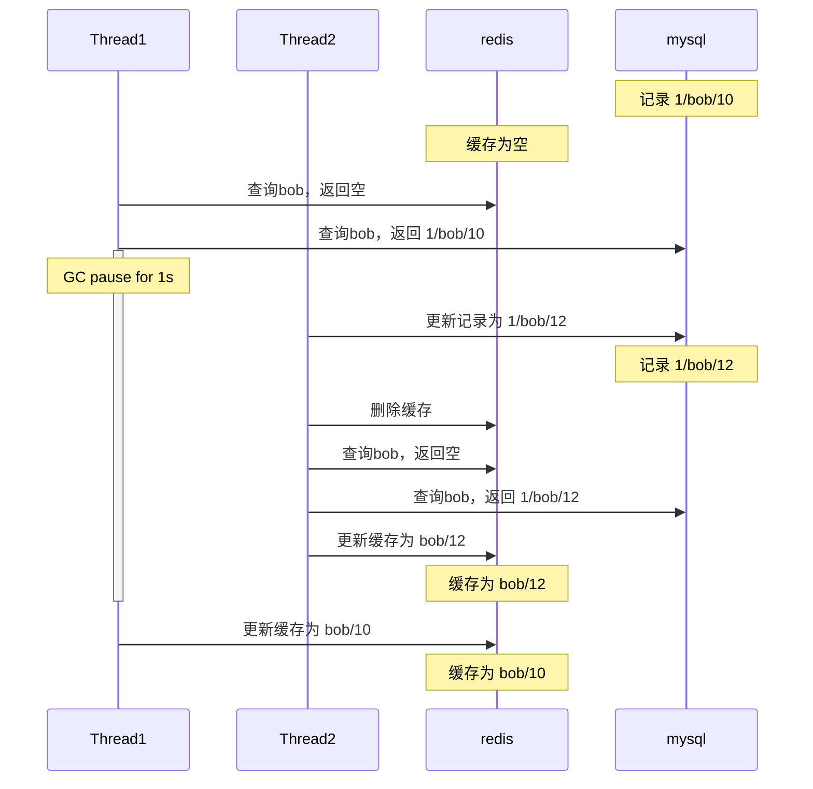
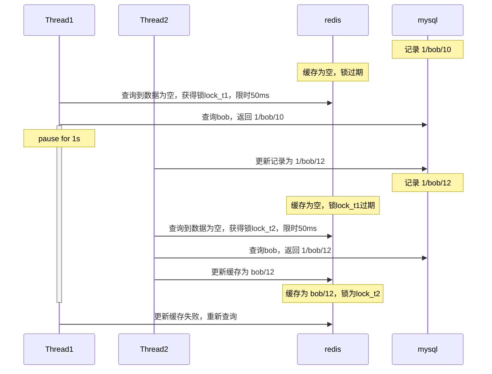

微服务下缓存实践是一个很大的话题，本文主要关注缓存和数据库的交互方式以及缓存一致性的讨论。
## 交互方式
### cache aside
  
最常见的交互方式，由业务方直接操作缓存和数据库，维持两者的一致。
> 注意  
> 写数据时先更新数据库，然后清空对应缓存，这种方式优于覆盖缓存，造成不一致的概率较低

### write through
  
将缓存置于数据库之前，由缓存负责更新数据库，而不是业务方。

### write back

和write through类似，区别在于异步更新数据库。

## 缓存一致性
首先必须澄清这里`缓存一致性`的概念，缓存和数据库中的数据在物理上当然不可能随时都一致，我们能做到的有以下几点
+ 提供统一的访问层，例如write through/back的方式，屏蔽业务层对数据库的感知，当然这样需要缓存做更多的工作
+ 提供最终一致性方案，在业务可接受的时间内，达到缓存和数据库的一致
+ 针对极端情况做优化

我们先研究基本的cache aside
### cache aside
项目准备
+ 克隆`https://github.com/cafewang/cache-chemist.git` ，使用Idea导入
+ jdk版本为17
+ 项目框架为springboot，包含web、jpa、redis模块
+ 使用k3d部署Kubernetes集群，包含mysql和redis，分别映射主机的8082和8081端口
+ 主机需安装docker和k3d环境，以创建集群
+ 使用前运行`deployment/deploy.bat`，linux系统也可运行其中内容

表结构如下

| id | name | age |
|:---:|:----:|:---:|
| 1  | bob  | 10  |

redis中存储了name/age的kv结构，即`bob/10`。  
cache aside实现如下
```java
// CacheAsideService
public Long getAge(String name, Long sleep) {
    String ageStr = stringRedisTemplate.opsForValue().get(name);
    if (Objects.nonNull(ageStr)) {
        return Long.parseLong(ageStr);
    }
    Person person = personService.getByName(name);
    try {
        Thread.sleep(sleep);
    } catch (InterruptedException e) {
        throw new RuntimeException(e);
    }
    if (Objects.isNull(person)) {
        return null;
    }
    String newAgeStr = person.getAge().toString();
    stringRedisTemplate.opsForValue().set(name, newAgeStr, Duration.of(1, ChronoUnit.MINUTES));
    return person.getAge();
}

public Long getAge(String name) {
    return getAge(name, 0L);
}

public void addPerson(Person person) {
    personService.save(person);
    stringRedisTemplate.opsForValue().getAndDelete(person.getName());
}

public void updateAge(String name, Long age) {
    personService.updateAge(name, age);
    stringRedisTemplate.opsForValue().getAndDelete(name);
}
```
更新操作都是删除缓存，而不是更新缓存。  
下面看看如下流程
+ 插入记录`1/bob/10`，删除`bob`对应缓存
+ 查询缓存为空，查询数据库并更新缓存`bob/10`
+ 更新记录为`1/bob/12`，删除`bob`对应缓存
+ 查询缓存为空，查询数据库并更新缓存`bob/12`

```java
// CacheChemistApplicationTests
	@Test
	void testCacheAside() {
		String name = "bob";
		Long age = 10L;
		cacheAsideService.addPerson(new Person(1L, name, age));
        Assertions.assertNull(stringRedisTemplate.opsForValue().get(name));
		Assertions.assertEquals(age, cacheAsideService.getAge(name));
		Long newAge = 12L;
		cacheAsideService.updateAge(name, newAge);
		Assertions.assertNull(stringRedisTemplate.opsForValue().get(name));
		Assertions.assertEquals(newAge, cacheAsideService.getAge(name));
	}
```

下面查看异常流程
+ 插入记录`1/bob/10`，删除缓存
+ 查询缓存为空，查询数据库得到`bob/10`，由于GC或线程调度，线程暂停了1s
  + 在这1s中，另一个线程更新记录为`1/bob/12`，删除缓存，然后查询缓存为空，查询数据库，更新缓存为`bob/12`
+ 线程继续执行，更新缓存为`bob/10`，出现数据不一致

```java
	@Test
	void testCacheAsideCornerCase() {
		String name = "bob";
		Long age = 10L;
		cacheAsideService.addPerson(new Person(1L, name, age));
		CompletableFuture<Void> future1 = CompletableFuture.runAsync(() -> cacheAsideService.getAge(name, 1000L));
		Long newAge = 12L;
		CompletableFuture<Void> future2 = CompletableFuture.runAsync(() -> {
			cacheAsideService.updateAge(name, newAge);
			cacheAsideService.getAge(name);
		});
        try {
            future1.get();
			future2.get();
        } catch (InterruptedException | ExecutionException e) {
            throw new RuntimeException(e);
        }
		Assertions.assertEquals(age, cacheAsideService.getAge(name));
		Assertions.assertEquals(newAge, personService.getByName(name).getAge());
    }
```

用流程图表示


虽然异常场景发生的概率不高，一旦发生，只有脏数据再次被更新，数据才会一致，这个时间可能长达几个小时甚至几天，解决方式如下
+ 采用定时跑批的形式，重点数据分钟级别或者小时级别更新到缓存，全量数据周级别更新到缓存，保证最终一致性
+ 参考[dtm项目](https://github.com/dtm-labs/rockscache/blob/main/helper/README-cn.md)的缓存一致性方案

### dtm cache
dtm cache是cache aside的改进方案。  
其本质是在缓存上加上限时锁，每个锁请求通过uuid(由owner字段表示)区分
+ 获得锁的查询线程，可以在锁周期内查库并更新缓存，这样锁周期被分为两个部分，缓存未更新和已更新
  + 如果缓存有数据，则异步查库并更新缓存，先返回旧数据
  + 缓存无数据，则同步查库并更新缓存，返回新数据
  + 更新缓存先判断owner是否变更，未变更说明未过期或没有新的锁请求，可以更新缓存，然后释放锁，已变更说明有别的查询线程获得了锁，这时重新执行查询流程
+ 未获得锁的查询线程，查到数据直接返回，查不到则等待一段时间(短于锁限时)再次尝试获取锁  
缓存采用hash存储(即java中的Map)，结构为
+ data，缓存的内容，有独立的过期时间，应大于锁限时
+ owner，即锁id，通过uuid生成
+ lockUntil，表示锁限时

这样不会出现并发更新缓存的情况，而且锁过期后，一旦有新的查询线程获取到锁，原查询线程会放弃更新缓存，不会导致旧数据更新缓存。  
数据库更新时，过期缓存对应的锁(lockUntil设为0)，使得下次查询触发异步更新。  
需要注意锁限时的设置，需要比`查库+更新缓存`时间更长，以免还没查询完锁就过期，时间也不能过长，导致其他查询线程等待时间太长。  
数据过期时间需要比锁限时长，否则会导致数据在锁限时内过期，查询线程重复等待的情况发生。  
我们来看看核心的代码实现
```java
// DtmService
public Long getAge(String name, Long sleep) {
  CacheStatus cacheStatus;
  while (Objects.isNull((cacheStatus = getAndLock(name, 50)).getData())
          && Objects.isNull(cacheStatus.getNewLock())) {
    try {
      Thread.sleep(10);
    } catch (InterruptedException e) {
      throw new RuntimeException(e);
    }
  }
  String newLock = cacheStatus.getNewLock();
  if (Objects.nonNull(newLock)) {
    if (Objects.isNull(cacheStatus.getData())) {
      FetchResult fetchResult = fetchData(name, newLock, sleep);
      return fetchResult.getSuccess() ? fetchResult.getData() : getAge(name);
    }
    CompletableFuture.runAsync(() -> fetchData(name, newLock, sleep));
  }
  return cacheStatus.getData();
}
```
getAndLock通过lua脚本完成两个操作，获取data以及尝试获取锁，如果获取到锁会返回锁的uuid
+ data为空且未获取到锁(其他查询线程持有锁)，则等待10ms再尝试
+ 获取到锁，如果数据为空，则同步查库并更新缓存，更新成功则返回，更新失败(锁被修改)则重新查询
+ 获取到锁，数据不为空，则返回数据，异步更新缓存
+ 未获取到锁，但是有数据则直接返回

来看下面两个测试场景
```java
// CacheChemistApplicationTests
	@Test
	void testDtm() throws InterruptedException {
		String name = "bob";
		Long age = 10L;
		dtmService.addPerson(new Person(1L, name, age));
		Assertions.assertEquals(age, dtmService.getAge(name));
		Long newAge = 12L;
		dtmService.updateAge(name, newAge);
		Assertions.assertEquals(age, dtmService.getAge(name));
		Thread.sleep(100);
		Assertions.assertEquals(newAge, dtmService.getAge(name));
		stringRedisTemplate.opsForHash().delete(name, "data", "owner", "lockUntil");
	}
```
+ 首次查询同步更新缓存，查询到新插入数据
+ updateAge将锁过期，后续查询返回旧数据，但是触发了异步更新缓存
+ 等待100ms后缓存更新，查询到新数据

再看一下corner case
```java
	void testDtmCornerCase() throws InterruptedException {
		String name = "bob";
		Long age = 10L;
		dtmService.addPerson(new Person(1L, name, age));
		CompletableFuture<Void> future1 = CompletableFuture.runAsync(() -> dtmService.getAge(name, 1000L));
		Long newAge = 12L;
		CompletableFuture<Void> future2 = CompletableFuture.runAsync(() -> {
			dtmService.updateAge(name, newAge);
			dtmService.getAge(name);
		});
		try {
			future1.get();
			future2.get();
		} catch (InterruptedException | ExecutionException e) {
			throw new RuntimeException(e);
		}
		Assertions.assertEquals(newAge, personService.getByName(name).getAge());
		Assertions.assertEquals(newAge, dtmService.getAge(name));
		stringRedisTemplate.opsForHash().delete(name, "data", "owner", "lockUntil");
	}
```
+ 首个查询线程查库后暂停了1s，更新缓存是发现锁被修改，所以没有更新，而是重新查询
+ 第二个查询线程等待锁过期后获取到锁，更新缓存成功，缓存中存的是新数据

用时序图来描述


生产环境中实现Dtm需要注意以下几点
+ 锁限时、未获取到锁的等待时间、数据过期时间设置需参考业务场景和数据库、缓存性能
+ 需要使用lua脚本，保证redis操作的顺序性
+ 需要根据业务场景，选择是否缓存空数据

## 总结
本文介绍了在微服务中实现缓存一致性的方案，cache aside一般是基础方案，dtm可以提供更强的一致性，不会出现旧数据覆盖新数据的情况。  
如果要保证最终一致性，还可以通过定时跑批补偿、领域事件、binlog异步更新作为补充，以更新时间作为版本，防止旧数据覆盖新数据。