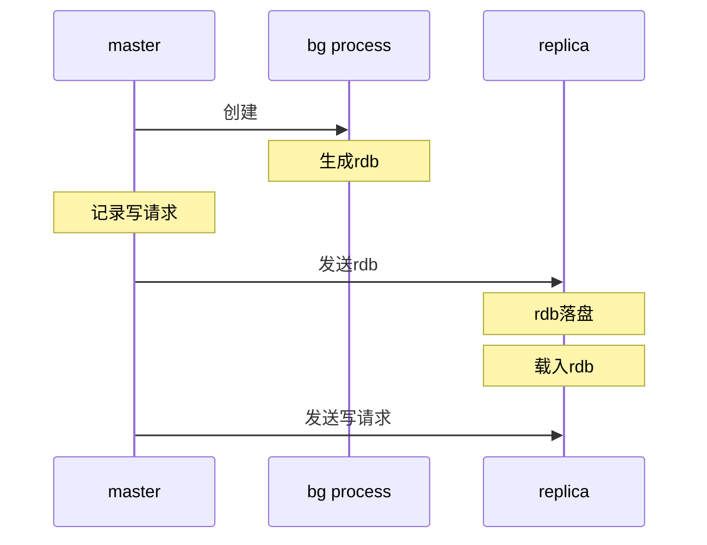

本文主要是总结redis相关的重要知识点和应用，通过实操来深入理解redis。

## 项目环境
克隆`https://github.com/cafewang/redis-ready.git` ，项目由gradle管理，无需单独下载。  
导入Idea，运行前安装k3d，按照文件`deployment/deploy.bat`安装集群并创建redis实例。  
部署完成后，redis实例运行在本地的`8081`端口，可以通过redis gui连接。  
这时可以运行项目中的测试。

## 数据结构
### string
string是redis中最基础的结构，就是记录了大小的字符数组，注意这是2010年的实现，但是原理没有大的变化。
```textmate
struct sdshdr {
    long len;
    long free;
    char buf[];
};
```
string的上限是512MB，即$$2^32$$比特。  
string大部分操作都是$$O(1)$$，只有substr、getrange、setrange等是$$O(n)$$。  
下面展示了setrange的使用
```java
// StringTest
@Test
void testLinearOps() {
    String key = "key", value = "Hello World";
    stringRedisTemplate.opsForValue().set(key, value);
    stringRedisTemplate.opsForValue().set(key, "Redis", 6);
    Assertions.assertEquals("Hello Redis", stringRedisTemplate.opsForValue().getAndDelete(key));
}
```
注意以下几点
+ setrange的位置offset是按字节算的，多字节编码需要自行计算正确的位置
+ offset范围不能超过string上限512MB
+ 如果offset超过字符串长度，redis会申请新空间，空间很大的情况下非常耗时

### JSON
redis拥有非常强大的JSON处理能力，能通过query engine提供类似sql的查询能力，还能提供ORM映射，这块内容非常丰富，不在本文展开

### List
redis的List是基于双向链表实现的，所以队头队尾的操作都是$$O(1)$$，而随机访问操作是$$O(n)$$。  
List的元素上限是$$2^32-1$$，下面演示基本操作。
```java
// ListTest
    @Test
    void testPushAndPop() {
        String key = "list";
        stringRedisTemplate.opsForList().leftPushAll(key, "1", "2", "3");
        Assertions.assertEquals("1", stringRedisTemplate.opsForList().rightPop(key));
        Assertions.assertEquals(2, stringRedisTemplate.opsForList().size(key));
        stringRedisTemplate.opsForList().leftPop(key, 3);
    }
```
首先插入三个元素，List为$$[3,2,1]$$，出队一个元素后，长度变为2。  
需要注意，redis中的集合类型有如下性质
+ 向不存在的集合插入元素，会创建集合
+ 删除空集合元素，会删除集合(Stream除外)
+ 对空集合执行只读操作(如取大小)，也会删除集合

### Set
这里将redis字典类型的结构汇总，包含Set、Hash、SortedSet。  
Set和Hash本质是一样的，都是无序字典，长度较小时实现为listpack(可以理解为键值对的列表)，较大时转为map(拉链法)。  
键值对最多为$$2^(32)-1$$个。
Set比较耗时的是SINTER求交集的操作，为$$O(N*M)$$，N是最小集合的大小，M是集合个数。  
重点介绍SortedSet，和java中的TreeSet不同，redis中的SortedSet是string和weight(浮点数)的pair，string必须不同，排序先比较weight然后比较string。  
举个例子
```java
// ZSetTest
    @Test
    void testOder() {
        String key = "zset";
        String v1 = "c", v2 = "d", v3 = "a";
        double score1 = 1, score2 = 1, score3 = 2;
        stringRedisTemplate.opsForZSet().add(key, v1, score1);
        stringRedisTemplate.opsForZSet().add(key, v2, score2);
        stringRedisTemplate.opsForZSet().add(key, v3, score3);
        Assertions.assertEquals(v3, stringRedisTemplate.opsForZSet().popMax(key).getValue());
        Assertions.assertEquals(v2, stringRedisTemplate.opsForZSet().popMax(key).getValue());
        Assertions.assertEquals(v1, stringRedisTemplate.opsForZSet().popMax(key).getValue());
        stringRedisTemplate.opsForZSet().popMax(key);
    }
```
依次插入了`1:c，1:d，2:a`，每次pop最大的值，由于a的score最大先被pop，c和d的score相同，所以字典序大的d先被pop，最后是c。  
SortedSet是通过SkipList实现的，是一种随机的、由多层链表构成的有序集合。  
  
如上图，查询key=50，先从上层链表查询到30的下个元素大于50，然后转到下层链表，顺序搜索到50。  
SkipList有如下优缺点
+ 优点
  + 搜索、插入、删除平均复杂度为$$O(log_2{n})$$
  + 实现相较红黑树要简单
+ 缺点
  + 存在极端情况下复杂度退化到$$O(n)$$
  + 需要$$O(n)$$的额外空间

根据上述分析可知，SortedSet大部分操作都是$$O(log_2{n})$$，除了ZRange是$$O(log_2{n}+m)$$，m是返回元素的个数，操作大集合时需要注意。

### Bitmap
Bitmap不是单独的结构，而是用string表示的bit向量，所以最多表示$$2^32$$个二进制位。  
Bitmap支持按位读写，以及与或非这些基本位运算，下面演示基本操作。
```java
// BitmapTest
    @Test
    void testCount() {
        String key = "bitmap";
        stringRedisTemplate.opsForValue().setBit(key, 0, true);
        stringRedisTemplate.opsForValue().setBit(key, 10, true);
        stringRedisTemplate.opsForValue().setBit(key, 100, true);
        Assertions.assertEquals(true, stringRedisTemplate.opsForValue().getBit(key, 100));
        Assertions.assertEquals(false, stringRedisTemplate.opsForValue().getBit(key, 99));
        Assertions.assertEquals(3, stringRedisTemplate.execute((RedisCallback<Long>) connection ->
                connection.stringCommands().bitCount(key.getBytes())));
        stringRedisTemplate.opsForValue().getAndDelete(key);
    }
```
测试在0、10、100置一，所以取位置100为true，99为false，总共有3位为一。

### Probabilistic
Probabilistic在redis中是统计概率、分布的结构，作为统计不追求绝对的准确，而是追求效率。

#### HyperLogLog
简称为HLL，这是一种神奇的结构，能够用最多12KB的内存来统计集合大小，即不同元素的个数，标准误差为0.81%。  
HLL的典型应用场景就是统计活跃用户，效率高但不完全准确。

### Bloom and Cuckoo Filter
Bloom和Cuckoo Filter给我们提供了这种功能，通过较少的内存消耗判断元素是否存在于集合中
+ 如果是，则元素有很大概率存在
+ 不是，则元素一定不在集合中

Bloom的关键在于失误率的设定，0.01%的失误率，对应每个元素占用19位，以及使用14个独立的hash函数。  
Bloom的插入性能为$$O(k)$$，k为hash函数个数，读性能为$$O(k*n)$$，n为堆叠的filter层数(capacity设置过小会引起堆叠，所以需合理设置)。  
Cuckoo的插入、读和删除性能均为$$O(1)$$。
两种算法比较如下
+ Bloom适合大量写入的场景，而cuckoo的读性能更佳，且支持删除操作

我们将在应用部分来讲解使用的细节。

## 淘汰策略
redis在占用内存达到maxmemory(默认为2MB)时，会触发淘汰策略，有如下几种
+ no eviction，不淘汰
+ all keys/volatile，可搭配如下淘汰策略，前者是所有的对象，后者是设置了过期时间的
  + lru，最近最少使用，注意redis使用的是近似算法，效率更高
  + lfu，最少使用频率
  + random，随机选择
+ volatile-ttl，淘汰最接近过期的对象

可以使用info命令查看redis信息，用来调整淘汰策略
+ 查看最大使用内存(包含被淘汰的对象)，如果比最大内存大太多，考虑调大最大内存
+ 查看缓存命中率，如果比预期低(热点数据访问占总访问的比例)
  + 查看淘汰的key数量，数量太多，可以考虑将volatile策略调整为all keys
  + 查看过期的key数量，如果太多，可以查看ttl时间是否过短、或者不应该过期

## 持久化
### RDB
RDB(redis database)是紧凑格式的单文件的redis数据快照。  
配置RDB很简单，如下配置表示，每60秒内有1000次修改就会触发快照(即生成新的RDB文件)，文件名默认为`dump.rdb`。  
```properties
save 60 1000
```
生成过程如下
+ redis fork产生子进程
+ 子进程将数据集写入临时的rdb文件
+ 写入完成，通过原子操作替换rdb文件

需要注意
+ 当数据集很大时，fork会严重占用CPU，导致redis在几毫秒甚至一秒内不能提供服务

### AOF
AOF(append only file)可以提供rdb不能提供的实时数据备份。  
通过如下配置开启
```properties
appendonly yes
```
自redis7.0起，aof由多个文件组成
```text
appendonly.aof.1.base.rdb
appendonly.aof.1.incr.aof
appendonly.aof.manifest
```
base文件(rdb或aof格式)表示某个数据快照(每次rewrite时的快照)，incr文件表示增量变更，可能有多个。  
redis通过rewriting压缩aof，创建新的incr文件追踪变更，历史数据全部写入新的base文件中，然后原子替换成新的base和incr文件。  
redis提供三种aof文件同步策略(fsync)
+ appendfsync always：每次变更都会落盘，但效率非常低。
+ appendfsync everysec：每秒落盘，这个是默认策略。
+ appendfsync no：由操作系统决定落盘时机，效率最高但也最危险。  

aof工作流程如下(redis>=7.0)
+ redis fork子进程
+ 子进程写入临时base文件
+ 父进程创建新incr文件，并append更新，这样即使子进程失败，当前状态仍由旧base+旧incr+新incr文件保持
+ 子进程写入完毕，父进程收到signal，切换到新的base和incr文件
+ redis会清理旧的base和incr文件

### 对比
+ 对于大数据集，RDB在重启方面一般快于AOF
+ rdb的体积相较于aof更小，而aof可读性更好，可以手动修改
+ 使用aof可以保证不丢失或只丢失一秒的数据，而rdb很难做到

### 重启
redis会根据配置恢复数据，默认情况下rdb开启，会读取dump.rdb作为初始数据。  
如果开启了aof，则优先读取base+incr文件。  
所以，如果重启时开启aof，需要先将dump.rdb文件转为aof文件，这样数据才能正常恢复。

### 备份
由于rdb文件只有一个，且产生后不会修改，只会原子替换，可以直接备份。  
aof文件不能直接拷贝，需要先关闭rewriting并等待现有rewriting结束后再拷贝，然后开启rewriting，不然可能得到无效的备份。

## 高可用
单机的redis实例简单容易理解，但单机性能总有上限，还会遇到单点故障的问题，来看看redis的高可用方案。

### replication
redis也支持主从模式，首先介绍重要概念
+ master，redis实例默认为master，支持读写
+ replica，同位redis实例，默认只读
+ master和replica间通过异步请求同步
+ 如果master和replica间连接断开一段时间后，replica重连，会尝试进行partial resync，同步断开期间丢失的更新
+ 如果partial resync不能成功，replica会执行full resync，获取master的全量数据

#### replication id
redis的数据状态是怎么表示的？简单来说就是replication id+offset。  
replication id是一串表示redis初始状态的随机数，在两种情况下生成
+ redis重启
+ replica晋升为master

replica连接上master后，会继承master的replication id。举个例子，我们有一个master和两个replica。
```text
# 输入命令 info replication
# master
master_replid c93295a0f2369023b49295072f4db6fb7428064f
master_replid2 0000000000000000000000000000000000000000
master_repl_offset 19770
second_repl_offset -1
# replica1
master_replid c93295a0f2369023b49295072f4db6fb7428064f
master_replid2 0000000000000000000000000000000000000000
master_repl_offset 19740
second_repl_offset -1
# replica2
master_replid c93295a0f2369023b49295072f4db6fb7428064f
master_replid2 0000000000000000000000000000000000000000
master_repl_offset 19754
second_repl_offset -1
```
可以看到，replica的replication id和master一致，但是offset不一样，而offset就是变更命令在replication stream中的位置，每当发生变更，offset就会增大。  
那master_replid2和second_offset是什么呢？当replica晋升为master后，原master由于网络原因可能仍在接收写请求，导致状态不一致，所以新master要再生成一个replication id，而原来的就放在master_replid2里。

#### replication流程
replica使用PSYNC命令执行同步，将自己的replication id+offset发给master，master将增量的命令发回replica。  
有两种情况不能增量同步
+ master的backlog缺失，即增量日志缺失
+ replica的replication id对于master未知

这时只能进行full replication。
#### full replication
master启动后台进程保存rdb文件，同时记录新的写请求。  
rdb保存成功时，master将rdb发送给replica，replica落盘后加载rdb。  
然后master发送新的写命令到replica。


### 心跳机制
replica每秒钟会ping maser，发送已确认的offset，master会记录每个replica最近回复的时间。  
用户可配置仅当master已连接N个replica，且每个replica延迟不超过M秒，才接收写请求。  
这样能缩短数据丢失的时间窗口，但不能保证写请求的一致性(在每个实例上都能读取到更新)，这不是replication框架能解决的。
```text
# 配置如下
min-replicas-to-write N
min-replicas-max-lag M
```

### 数据一致性
由于主从同步的延迟，路由到replica的读请求可能会读取到旧数据。  
想获取最新数据，我们可以使用wait命令，比如`wait 2 1000`，会client等待，直到至少2个replica同步了之前的全部写请求或者超时。  
这样并不能保证获取到最新数据，或保证最新数据不会丢失(未获取到最新数据的replica可能晋升为master)，但能提供大概率的兜底。

### 重启
master和replica都需要开启rdb，因为rdb会保存replication id+offset，而仅使用aof，这些状态会丢失。

### 淘汰策略
和master不同，replica不会主动过期key
+ master过期或淘汰key时，会向replica发送del命令
+ 为了保持读请求一致，replica会隐藏已过期的数据，但不会直接删除
+ lua脚本执行过程中不会过期数据，防止master和replica执行结果不一致
+ 业务中需要使用expireAt或pExpireAt，减少过期数据不一致的窗口期

### 最大内存
replica默认会忽略maxmemory配置，因为replica会跟踪master的状态，大部分时间下，都不会超过master设置的maxmemory，但是应用需要留出一些空间做缓冲。

### sentinel
sentinel可以解决主从架构下的这两个问题
+ master宕机后replica怎么晋升为master
+ client怎么知道当前master是谁

#### 部署
我们部署一个一主两从三个sentinel的集群，在`deployment/redis-sentinel`文件夹下。
```yaml
apiVersion: v1
kind: ConfigMap
metadata:
  name: redis-config-master
data:
  redis-config: |
    maxmemory 128mb
    maxmemory-policy allkeys-lru
    save 60 1000
    appendonly yes
    replica-announce-ip redis-service-master
    replica-announce-port 6379
    client-output-buffer-limit replica 512mb 256mb 120
---
apiVersion: v1
kind: ConfigMap
metadata:
  name: redis-config-rep1
data:
  redis-config: |
    maxmemory 128mb
    maxmemory-policy allkeys-lru
    save 60 1000
    appendonly yes
    replicaof redis-service-master 6379
    replica-announce-ip redis-service-rep1
    replica-announce-port 6379
    client-output-buffer-limit replica 512mb 256mb 120
```
上面是master和replica1的配置(replica2类似)
+ maxmemory和maxmemory-policy是内存上限和淘汰策略
+ save是rdb配置，表示60秒内有1000次以上的更新触发创建rdb文件
+ appendonly是aof开关
+ replicaof指定replica对应的master，这里`redis-service-master`是service name，6379是端口
+ replica-announce-ip和replica-announce-port表示sentinel给client展示的域名(或ip)和端口
+ client-output-buffer-limit指定主从同步时的缓冲区大小，512mb是上限，120秒内256mb是软上限，达到上限或一段时间内达到软上限，会断开连接，所以要按需设置大一些

```yaml
apiVersion: v1
kind: ConfigMap
metadata:
  name: redis-sentinel-config-s0
data:
  redis-config: |
    port 5004
    sentinel monitor mymaster redis-service-master 6379 2
    sentinel down-after-milliseconds mymaster 5000
    sentinel failover-timeout mymaster 60000
    sentinel parallel-syncs mymaster 1
    sentinel resolve-hostnames yes
    sentinel announce-hostnames yes
    sentinel announce-ip redis-service-s0
    sentinel announce-port 5004
---
```
上面是sentinel1的配置，另外两个配置类似
+ port是sentinel的端口
+ mymaster是集群名称，monitor后面跟监控的master的地址，最后的2是quorum大小，表示同时有两个sentinel发现master宕机才会发起选举(选举成功至少要majority数量的sentinel)
+ down-after-milliseconds表示sentinel判断master宕机需要的时长(即最后一次成功的ping和当前时间的差)
+ parallel-syncs表示新master同时reconfigure的replica数量，reconfigure的过程中会阻塞replica的读请求，所以不要设置为replica总数
+ resolve-hostnames、announce-hostnames以及announce-ip和announce-port指定sentinel之间通信的地址

> 注意  
> redis-sentinel中，要么全部使用域名作为地址，要么全部使用ip，不要混用  
> kubernetes集群中部署redis-sentinel，最好使用service name作为域名通信，
> 这样不会受pod启停的ip变更影响

#### 状态查询
通过sentinel，我们可以查询master和replica的状态。  
先通过redis-cli登录sentinel，我们有三个sentinel实例，这里登录第一个，登录其他的没有区别
```shell
# run redis container and log in
k run -it --image=redis:alpine -- cli
k exec -it cli -- sh
# login redis sentinel
redis-cli -h redis-service-s0 -p 5004
```
查询master
```shell
sentinel master mymaster
 1) "name"
 2) "mymaster"
 3) "ip"
 4) "redis-service-rep1"
 5) "port"
 6) "6379"
31) "num-slaves"
32) "2"
33) "num-other-sentinels"
34) "2"
35) "quorum"
36) "2"
```
这里只保留了一些关键信息，比如master的地址、replica数量、其他sentinel数量、quorum数量。  
查询replica
```shell
sentinel replicas mymaster
1)  1) "name"
    2) "redis-service-rep2:6379"
    3) "ip"
    4) "redis-service-rep2"
    5) "port"
    6) "6379"
   33) "master-host"
   34) "redis-service-rep1"
   35) "master-port"
   36) "6379"
2)  1) "name"
    2) "redis-service-master:6379"
    3) "ip"
    4) "redis-service-master"
    5) "port"
    6) "6379"
   33) "master-host"
   34) "redis-service-rep1"
   35) "master-port"
   36) "6379"
```
综合以上信息，我们可以看到集群当前的master是replica1，而replica有replica2和原来的master，集群经历过重新选主。  
获取master地址，这是sentinel和client交互中最常用的命令
```shell
SENTINEL get-master-addr-by-name mymaster
1) "redis-service-rep1"
2) "6379"
```

#### failover测试
当前master为replica1，我们删除对应的deployment(保留service)，过一会再创建deployment，这样剩下的replica2和原master就会有一个晋升为新的master。
```shell
k delete deploy redis-deployment-rep1
# switch to sentinel0
SENTINEL get-master-addr-by-name mymaster
1) "redis-service-master"
2) "6379"
```
由于down-after-milliseconds设置为5秒，经过5秒后，sentinel判定replica1宕机，将master选为新的master。  
我们再恢复replica1
```shell
k apply -f .\redis-rep1.yaml
# switch to sentinel0
sentinel replicas mymaster
1)  1) "name"
    2) "redis-service-rep1:6379"
    3) "ip"
    4) "redis-service-rep1"
    5) "port"
    6) "6379"
   33) "master-host"
   34) "redis-service-master"
   35) "master-port"
   36) "6379"
2)  1) "name"
    2) "redis-service-rep2:6379"
    3) "ip"
    4) "redis-service-rep2"
    5) "port"
    6) "6379"
   33) "master-host"
   34) "redis-service-master"
   35) "master-port"
   36) "6379"
```
可以看到恢复后replica1确认master为新的master。  
sentinel的命令还有很多，我们会在后续章节结合使用场景讲解。

#### pub/sub
client可以监听sentinel发出的事件，从而做出相应决策。
```shell
# sentinel0
psubscribe *
```
我们监听了所有事件，然后删除replica1对应的deployment(此时replica1为master)
```shell
k delete deploy redis-deployment-rep1
# switch to sentinel0
3) "+sdown"
4) "master mymaster redis-service-rep1 6379"
3) "+odown"
4) "master mymaster redis-service-rep1 6379 #quorum 2/2"
3) "+try-failover"
4) "master mymaster redis-service-rep1 6379"
3) "+selected-slave"
4) "slave redis-service-master:6379 redis-service-master 6379 @ mymaster redis-service-rep1 6379"
3) "+promoted-slave"
4) "slave redis-service-master:6379 redis-service-master 6379 @ mymaster redis-service-rep1 6379"
3) "+slave-reconf-done"
4) "slave redis-service-rep2:6379 redis-service-rep2 6379 @ mymaster redis-service-rep1 6379"
3) "-odown"
4) "master mymaster redis-service-rep1 6379"
3) "+failover-end"
4) "master mymaster redis-service-rep1 6379"
3) "+switch-master"
4) "mymaster redis-service-rep1 6379 redis-service-master 6379"
3) "+slave"
4) "slave redis-service-rep2:6379 redis-service-rep2 6379 @ mymaster redis-service-master 6379"
3) "+slave"
4) "slave redis-service-rep1:6379 redis-service-rep1 6379 @ mymaster redis-service-master 6379"
3) "+sdown"
4) "slave redis-service-rep1:6379 redis-service-rep1 6379 @ mymaster redis-service-master 6379"
3) "-sdown"
4) "slave redis-service-rep1:6379 redis-service-rep1 6379 @ mymaster redis-service-master 6379"
```
中间部分消息被忽略，我们可以看出整个failover的过程
+ sentinel察觉master宕机，发出+sdown
+ quorum个sentinel认为master宕机，发出+odown，启动failover
+ 选出待晋升的replica，这里是`redis-service-master`
+ 晋升成功，开始reconf过程，更新新的replica的配置以及数据
+ reconf完成，发出+switch-master，client可以监听此事件更新master
+ 发出+slave，表示新的replica已添加
+ 手动重启replica1后，-sdown显示replica1已作为replica恢复运行

#### sentinel/replica discovery
在sentinel中只需要指定最初的master地址，就可以自动发现其他的replica以及sentinel的地址，这也是通过pub/sub实现的。  
sentinel会订阅master和replica的`__sentinel__:hello`这个channel，并定时向其中发布自己的地址。  
hello消息中包含sentinel最新的地址以及master的配置信息，所以sentinel会自动同步最新配置。
```shell
subscribe __sentinel__:hello
3) "redis-service-s0,5004,2a3bc966803f957bc5921319a0f3d9fb69ffeddc,4,mymaster,redis-service-master,6379,4"
3) "redis-service-s1,5005,8a4604ca225eedfd2ac0e145729f01f5a5a3e0db,4,mymaster,redis-service-master,6379,4"
3) "redis-service-s2,5006,d840ae66fb00df8aea558fe8b7e046ac8d2a37bf,4,mymaster,redis-service-master,6379,4"
```
上面就是用redis-cli登录replica1订阅的结果，可以看到所有sentinel的地址。

#### failover启动
成功启动failover，需要经历下面的过程
+ 部分sentinel发现master在down-after-milliseconds(项目设为5秒)的时间内，没有回复正确的响应，发出+sdown事件
+ 如果某sentinel发现quorum个sentinel在一段时间内都认为master处于离线状态，则发出+odown事件
+ +odown事件会触发检测majority个sentinel都在线，这时才会真正启动failover

#### reconfiguration
除了failover，sentinel还会在以下情况执行reconf
+ 自认为是master的replica，会被配置为真正的master的replica
+ 连接到错误master的replica，会被配置为连接真正的master

sentinel不会马上修正配置错误的replica，而是确认错误持续时间超过新配置广播的时间，这样是为了防止sentinel从分区恢复时，将过期配置同步到实例。

#### replica selection
failover启动后（+odown事件已发出，且已经从majority中选举出执行failover的sentinel），就会开始选举新的master。  
首先筛选和master断连时间不超过如下公式的replica。

$$
(down-after-milliseconds * 10) + SDOWN\_state\_ms
$$

然后按以下指标排序
+ replica priority，越小越靠前，0表示不参与选举
+ offset，越大越靠前
+ run id，字典序小的被选中

举个例子，如下replica是这样排序的

| **order** | **priority** | **offset** | **run id** |
|-----------|--------------|------------|------------|
| 1         | 1            | 100        | abc        |
| 2         | 1            | 100        | bcd        |
| 3         | 1            | 95         | cad        |
| 4         | 2            | 100        | acd        |
| 5         | 0            | 100        | bde        |

#### quorum
quorum的设置在failover中起到极其重要的作用
+ quorum个sentinel触发+sdown并持续一段时间，才会触发+odown
+ $$min(quorum,majority)$$个sentinel连通才能选出执行failover的sentinel

所以通过设置quorum可以调节集群failover的灵敏度。

## 应用
### 分布式锁
### rate limiter
### leaderboard
### daily active users
## 常见问题