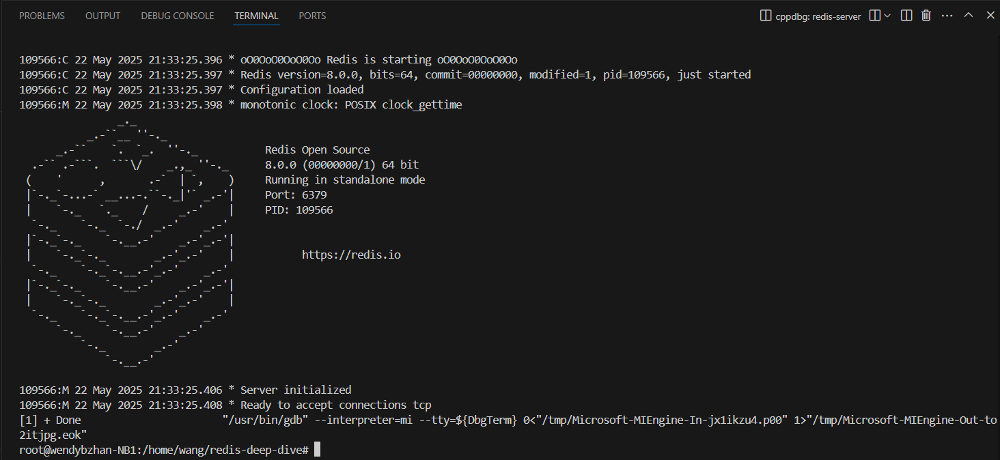

redis是比较适合学习的开源框架，而调试又是研究源码最佳的方式，本文将两者结合，讨论一下怎样调试redis。

## 环境准备
+ 使用主机为win10，安装vscode作为IDE
+ 安装WSL，参考[文档](https://learn.microsoft.com/zh-cn/windows/wsl/install)，安装`Ubuntu 20.04.6 LTS`系统
+ 登录WSL系统，克隆项目`https://github.com/cafewang/redis-deep-dive` 
+ 在项目的`redis-8.0.0`目录下安装redis，参考[文档](https://redis.io/docs/latest/operate/oss_and_stack/install/build-stack/ubuntu-focal/)
  + 在项目的根目录下解压`redis-8.0.0.tar.gz`文件
  + 执行make时添加`noopt`选项，更适合调试
  + 执行make时，添加`-k -d`选项，显示更多信息，便于排查安装问题
+ 在项目的`shunit2-2.1.8`目录下安装shunit2，参考[文档](https://github.com/kward/shunit2) ，用于运行测试
  + 在项目的根目录下解压`shunit2-2.1.8.tar.gz`文件
+ 在项目根目录下运行`code .`，启动vscode（运行在ubuntu系统上，可以执行make、gcc等命令）
+ 创建调试配置文件`.vscode/launch.json`
```json
{
    "version": "0.2.0",
    "configurations": [
        {
            "name": "debug redis",    
            "type": "cppdbg",                       // 默认这个就好
            "request": "launch",                    // 默认这个就好
            "program": "${workspaceFolder}/redis-8.0.0/src/redis-server",  // 编译出来的文件的路径,得包含文件名
            "args": [                               // 程序运行时的命令行参数。
                "../redis.conf"
            ],
            "stopAtEntry": false,                    // 是否在程序入口处暂停调试。不严谨的讲就是是否在main函数处暂停。
            "cwd": "${workspaceFolder}/redis-8.0.0/src",            // 调试时程序运行的目录
            "environment": [],                      // 环境变量设置，一般默认为空就好
            "externalConsole": false,               // 一般不打开外部控制台
            "MIMode": "gdb",                        // 调试器模式，"gdb" 表示使用 GNU 调试器。
            "miDebuggerPath": "/usr/bin/gdb",
            // "preLaunchTask": "shell",            // 调试前需要执行的任务名称，那当然是先编译啦，这里不需要
        },
    ]
}
```
+ 在redis源文件中打上断点，点击下方所示按钮即可开始调试

+ redis启动成功会在终端中显示如下信息


## 测试框架
我们期望采取`自下而上`的方式来分析redis项目，即先了解独立的模块和类，再串联整体的流程和功能。  
测试位于`integration-test`下，使用`shunit2`框架驱动，需要从github上下载，解压到`shunit2-2.1.8`。  
以测试sds为例
```shell
#! /usr/bin/env bash

oneTimeSetUp() {
  pythondir=`gdb -q --command=../pythondir.gdb`
  redisdir="../../redis-8.0.0"
  cp ../gdb_util.py $pythondir
}

testSds5Struct() {
  export testFunction=${FUNCNAME[0]}
  gdb -q -ex='source test.py' --args $redisdir"/src/redis-server" $redisdir"/redis.conf"
}

. ../../shunit2-2.1.8/shunit2
```
+ oneTimeSetUp会在整个测试的开始时执行一次，这里主要是初始`gdb_util.py`模块，放到python的include路径下
+ testSds5Struct为测试方法，必须以test开头
  + testFunction是执行的方法名，在`test.py`中
  + 通过gdb调试redis-server，并且执行`test.py`脚本
+ 通过`. ../../shunit2-2.1.8/shunit2`引入shunit2框架

使用gdb，能够不重新编译整个c程序，来调用c程序中的方法。
```python
import gdb_util
import os

def testSds5Struct():
    gdb_util.setup()
    str = "abc"
    gdb.execute('start')
    gdb.execute(f'set $obj = sdsnew("{str}")')
    gdb.execute('set $flag = *(((char*)$obj) - 1)')
    gdb.execute('set $type = $flag & 0b111')
    gdb.execute('set $len = $flag >> 3')
    type = gdb.parse_and_eval("$type")
    len = gdb.parse_and_eval("$len")
    code = 0
    if type != 0 or len != 3:
        code = 1
        print(f"Error: type = {type}, len = {len}")
    gdb.execute(f'quit {code}')

func = os.environ['testFunction']
locals()[func]()
```
+ gdb模块是gdb自动引入的，通过`gdb.execute(...)`可以执行gdb命令
+ gdb.execute('start')启动redis-server，并在main方法入口暂停
+ 程序暂停时，可以自定义参数，执行程序中的方法
+ 上述代码执行了`sdsnew`方法创建了sds对象，并验证了type和len字段的值
+ 如果验证失败，返回code=1
+ 在shell中，函数最后一行命令的返回码不为0，判断为执行失败

使用这种方式测试有如下几种优点
+ 可以在不修改源码的情况下，调试c程序中特定的函数，以了解特定部分的功能
+ 可以通过断点，查看任意位置变量的值
+ 可以自动化测试，不需要手动执行调试

后续我们也会基于此种方式，了解redis不同模块的逻辑。
