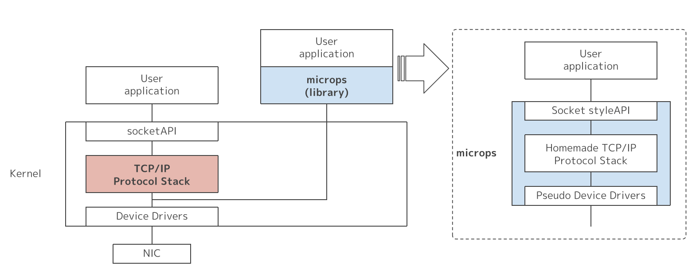
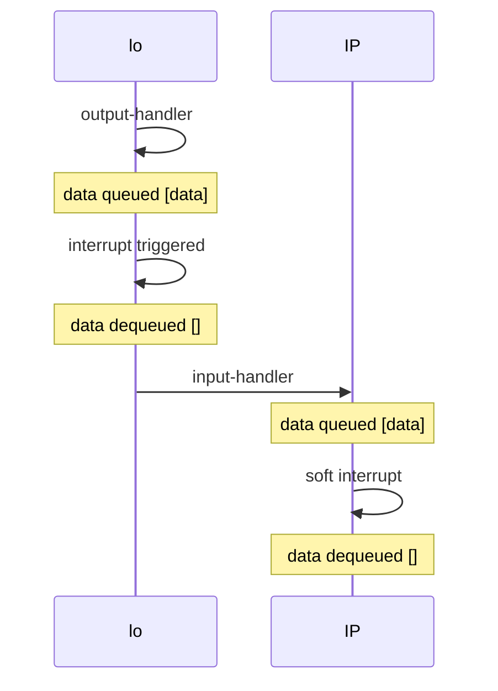

[microps](https://github.com/pandax381/microps)是一个非常适合新手学习的TCP/IP协议栈，使用C+Make开发，搭配一套非常详细的ppt教程，让我们能渐进式地彻底了解TCP/IP协议栈。  
本文记录和梳理第一章ppt中的重点内容

## 架构

如上图所示，microps并不是内核态中的协议栈，而是用户态中的协议栈，通过虚拟设备完成数据的收发。

上图是microps的ppt第一章的主要数据流，数据由loopback（简称lo，一种网络设备）发出，首先存储在设备的队列中，相当于缓冲区。 
接着lo设备中断被触发，数据出队，通过input-handler发送给匹配的协议（这里是IP），保存在IP的队列中。 
接着IP设备中断被触发，数据出队，第一章仅将数据包打印展示，没有进一步处理。

## 初始化
设备(dev)和协议(protocol)都通过链表形式管理，初始化时作为表头注册。  
每个协议都有一个输入队列，用于模拟缓冲区。  
设备还有一个priv指针（`void *`），指向设备特有的数据。  
loopback设备的priv指针指向一个loopback结构体，该结构体也包含一个输入队列，由变长结构体组成。  
举个例子: 

<iframe
frameBorder="0"
height="450px"
src="https://onecompiler.com/embed/c/443xzmfcj?hideLanguageSelection=true&hideNew=true&hideNewFileOption=true&disableCopyPaste=true&disableAutoComplete=true&hideStdin=true&hideEditorOptions=true"
width="100%">
</iframe>

例子中就是一个变长结构体构成的队列，申请空间时，`sizeof`只包含前两个字段的长度，第三个字段`char data[]`需要根据需求额外申请。

## 中断
真实设备(如网卡)是通过硬件中断，在数据到来或可以发送时和操作系统交互的。microps中通过软件中断模拟这一行为。  
比如output-handler中，数据被写入缓冲区后，会触发一个软件中断，然后通过中断处理程序（ISR，interrupt service routine）处理缓冲队列中的数据。  
下面展示两种中断的使用方式。

<iframe
frameBorder="0"
height="300px"
src="https://onecompiler.com/embed/c/443y6vaer?hideLanguageSelection=true&hideNew=true&hideNewFileOption=true&disableCopyPaste=true&disableAutoComplete=true&hideStdin=true&hideEditorOptions=true"
width="100%">
</iframe>

上面这种是在单线程中使用，通过`onSignal`注册，`raise`触发当前线程的信号。

<iframe
frameBorder="0"
height="1000px"
src="https://onecompiler.com/embed/c/443zy77se?hideLanguageSelection=true&hideNew=true&hideNewFileOption=true&disableCopyPaste=true&disableAutoComplete=true&hideStdin=true&hideEditorOptions=true"
width="100%">
</iframe>

上面是多线程中使用信号的方式，需要注意以下几点：
+ 主线程使用`pthread_sigmask`屏蔽在子线程中响应的信号
+ 使用`pthread_barrier`同步主子线程，确保子线程启动完毕后，主线程再发送信号
+ 信号34~64为用户自定义信号，且重复信号会排队，而1~31为系统信号，重复信号会覆盖
+ 如果不加`sleep(0)`，非实时信号(1~31)会被优先处理

